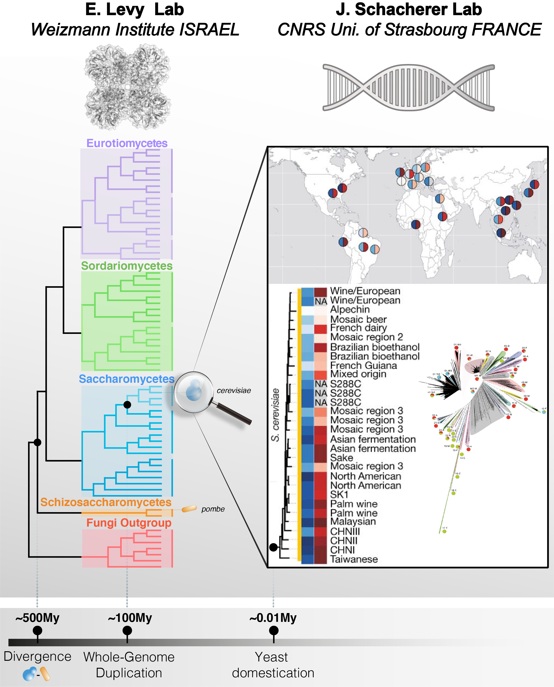

--- 
title: "Intraspecies proteome expression"
project: "Integrating gene expression layers and timescales of protein evolution from distant species to populations"
author: 
  - Benjamin Dubreuil^[Weizmann Institue of Science, https://github.com/benjamin-elusers/]
  - Elie Teyssonniere^[Universite de Strasbourg (CNRS), https://github.com/elielink/]
github: 
  -"benjamin-elusers"
  -"elielink"
mail: 
  - "benjamin.dubreuil-at-weizmann.ac.il"
  - "elieteyssonniere-at-gmail.com"
created: "24/04/2022"
date: "`r format(Sys.time(), '%d-%b-%Y %R %p')`"
site: bookdown::bookdown_site
# output: bookdown::gitbook
documentclass: book
bibliography:
- book.bib
- packages.bib
description: |
  This book is a report for analyzing gene expression profiling between 8 isolated
  strains from Saccharomyces cerevisiae.
biblio-style: apalike
csl: chicago-fullnote-bibliography.csl
---
```{r include=FALSE, cache=FALSE}
# example R options set globally
options(width = 60)

# example chunk options set globally
knitr::opts_chunk$set(
  comment = "#>",
  collapse = TRUE,
  out.width="100%"
)
```

.updatemenu-dropdown-button-group{
    max-height: 50px;
    overflow-x: hidden;
    overflow-y: auto;
}

# Introduction

## About

This project results from a collaboration between the groups of E. Levy (Weizmmann, IL)
and J. Schacherer (CNRS/Univ. Strasbourg). 

## Abstract

Cells and their proteomes constantly evolve and adapt to survive in a wide
variety of ecological niches. While phenotypic diversity arises in populations
on relatively short timescales (1 to 100s thousand years), longer timescales (1
to 100s million years) are involved in divergence between species. The
signatures of both evolutionary processes are carved in each and every single
protein sequence through accumulation of mutations, thereby reshaping cell
machineries, including protein complexes, signaling pathways, and metabolic
pathways for example.

Interestingly, over long timescales, different proteins accumulate mutations at
markedly different rates. For example, orthologous proteins in S. cerevisiae and
S. pombe share *42%* (+/- 14%) sequence identity on average, but some orthologs
exhibit higher conservation. For example, actins share *89.7%* sequence identity,
illustrating that some proteins tolerate mutations more than others. One
biophysical property correlates with sequence divergence more than any other and
that is protein abundance. The more abundant a protein, the more conserved its
sequence. While the abundance-conservation correlation is well established,
its mechanistic origin is not well understood. Toxicity associated with
mutation-induced misfolding has been suggested as a possible origin, but recent
works, including ours (Dubreuil et al. 2019) show it is unlikely
the main driving mechanism.

To resolve mechanisms shaping protein evolution, we propose to integrate
analyses of sequence evolution across timescales. On the one hand, evolution
across distant species shows wide dynamic range of sequence conservation, and
reflects how entire proteomes diverge with time. On the other hand, it also
presents two important drawbacks. First, that functional information of one
species (e.g., protein abundance) is implicitly extrapolated to other species,
and such an assumption is frequently incorrect. Second, the order in which
mutations occur can hardly be traced. For example, considering a gene
duplication event that occurred several million years ago, it is impossible to
distinguish mutations that occurred right after the duplication event from those
that arose later. Remarkably, both of these limitations are resolved when
measuring evolution across a population. Indeed, the short evolutionary
distances seen across strains mean that functional information can be
extrapolated with high confidence, and mutations can be situated in a narrow
time-window. Thus, by resolving these limitations, the integration of
evolutionary data across species and strains (Figure \@ref(fig:project-goal))
will provide new insights into constraints that biophysics (in particular
abundance) versus function place on protein evolution.

```{r project-goal, echo=F, fig.cap='Integrating timescales in protein evolution from distant species to populations', out.width = "100%"}

```

```{r biblio, include=FALSE}
# automatically create a bib database for R packages
knitr::write_bib(c(
  .packages(), 'bookdown', 'knitr', 'rmarkdown'
), 'packages.bib')
```


```{r setup, include=F, echo=F, warnings=F, message=F}
chap_cur = 00
# Make sure the install repositories for dependencies are CRAN + Bioconductor
#options(repos = c(getOption("repos"), BiocManager::repositories()))
knitr::opts_chunk$set(echo = T, collapse = T, cache.lazy = F,autodep = T, warning = F)
# HAVE TO INSTALL IN LINUX: Curl and Cairo library
suppressPackageStartupMessages({
  library(here)
  source("https://raw.githubusercontent.com/benjamin-elusers/yeastomics/main/src/__setup_yeastomics__.r")
  library(xfun)
  dep.pkg = c("corrplot", "ggtree", "gtools", "pbapply", "gridExtra", "GGally",
    "dplyr", "performance", "ggplot2",  "ggfortify", "tidyverse", "gplots",
    "data.table", "ggpubr", "ggcorrplot", "plotly", "ggsignif", "ape","kableExtra",
    "ggcorrplot","formattable","DT","sessioninfo")
  xfun::pkg_attach2(dep.pkg)
  source(here("src","functions_transcriptomics.R"))
  source(here("src",'function_proteomics.r'))
})
# turn off annoying messages from dplyr::summarise
options(dplyr.summarise.inform = FALSE)
graphics.off()

# Yeast data
sc_annofile = here('data','yeast-annotations.rds')
sc_annotation = preload(sc_annofile, load.annotation(),doing='loading annotations data for yeast...')
sc_annotation_orf = dplyr::select(sc_annotation,-c(SGD,GENENAME,ROLE,LOC,COMPLEX,node,nprot,nsp,taxon))
sc_identifiers = sc_annotation %>% dplyr::select(SGD,ORF,UNIPROT,GENENAME)

riboseq_strains = c('AMH','BAN','BED','BPL','BTT','CMP','CPI','CQC') # Strains with riboseq data (on 14/01/21)
strains.info = load.peter2018.data(1) %>%  # strains info from supp mat of Science paper
                 mutate( has_riboseq = standardized_name %in% riboseq_strains)

yk11_all_snp = left_join(readRDS(here('data','YK11-SNP_NT.rds')),
                         readRDS(here('data','YK11-SNP_AA.rds')), 
                         by=c('id', "aa_pos"='ref_pos', 'alt_codon_aa' = 'alt_aa'), 
                         suffix = c("_nt", "_aa") ) %>%
    left_join(sc_identifiers,by=c('id'='ORF'))


y8_all_snp = left_join(readRDS(here('data','Y8-SNP_NT.rds')),
                       readRDS(here('data','Y8-SNP_AA.rds')), 
                       by=c('id', "aa_pos"='ref_pos', 'alt_codon_aa' = 'alt_aa'),
                       suffix = c("_nt", "_aa")) %>% 
  left_join(sc_identifiers,by=c('id'='ORF'))

# Conservation/evolutionary rate
evo_fungi = read_delim(here('output','evolution-fungi-protein.tsv'),delim='\t') 
evo_snp = read_delim(here('output','evolution-snp-protein.tsv'),delim='\t') 
fungi_rate = evo_fungi %>% dplyr::select(r4s:leisr_local) %>% as.matrix
strains_rate = evo_snp %>% dplyr::select(r4s:leisr_local) %>% as.matrix
er_fungi_cor = cor(fungi_rate,use='pairwise.complete',met='spearman')
er_strains_cor = cor(strains_rate,use='pairwise.complete',met='spearman')

p_fungi  =ggcorrplot(er_fungi_cor,type='upper',method='circle',lab = T,lab_size = 3, title='fungi evo. rate',ggtheme = theme_classic())
p_snp = ggcorrplot(er_strains_cor,type='upper',method='circle',lab = T,lab_size = 3, title='strains evo. rate',ggtheme = theme_classic())
ggsave(p_fungi, path = here('plot'),filename='cor-evolution-fungi.png',scale=1.2)
ggsave(p_snp, path = here('plot'),filename='cor-evolution-snp.png',scale=1.2)
er_fungi_worst   = colnames(er_fungi_cor)[ abs(er_fungi_cor[1,]) < 0.7 ]
er_strains_worst = colnames(er_strains_cor)[ abs(er_strains_cor[1,]) < 0.7 ]

# Keep the best evolutionary rates (correlates with r4s > 0.7)
evo_yeast = left_join(evo_snp,evo_fungi, by=c('id','len_ref'),suffix=c('.yk11','.fungi')) %>% 
            mutate(HAS_ORTHOLOG = !is.na(len_msa.fungi) ) %>% 
    left_join(sc_identifiers,by=c('id'='ORF')) %>% 
    dplyr::mutate( f_snp = n_mismatched/len_msa.yk11, pid.fungi=1-f_mismatched) %>%
    dplyr::rename(orf=id,n_snp = n_mismatched) %>%
    dplyr::select(-f_mismatched) %>%
    relocate(orf,UNIPROT,GENENAME,SGD,HAS_ORTHOLOG, len_ref,
             len_msa.yk11, n_snp,f_snp, len_msa.fungi,pid.fungi) %>% 
    dplyr::select(-paste0(er_fungi_worst,'.fungi'),-paste0(er_strains_worst,'.yk11'))

# test = evo_yeast%>% dplyr::select(n_snp:leisr_local.fungi) %>% as.matrix()
# test_cor = cor(test, use='pairwise.complete',method='spearman')
# ggcorrplot(test_cor,type='upper',method='circle',lab = T,lab_size = 3, title='')
```

```{r save-yeast-data, echo=F}
save.image(here::here('output',sprintf("%02d-yeast-data.rdata",chap_cur)))
```

<!--chapter:end:index.Rmd-->

```{r include=FALSE, cache=FALSE}
# example R options set globally
options(width = 60)

# example chunk options set globally
knitr::opts_chunk$set(
  comment = "#>",
  collapse = TRUE,
  out.width="100%"
)
```
```{r load-setup-data, echo=F}
chap_cur=01
chap_num = sprintf("%02d-",chap_cur)
load(here::here('output',sprintf("%02d-yeast-data.rdata",chap_cur-1)))
```

# Transcriptomics {.tabset .tabset-pills}

## Summary

During evolution, mutations arise in genomes, potentially affecting every gene
and protein at every site over time. Degrees of sequence divergence within
populations and between species reflect the interplay between several
interconnected constraints (e.g., genomic, transcriptional, functional,
biophysical, structural, environmental…) and underlie phenotypic diversity and
organism fitness. Protein expression is the main determinant of a protein’s
sequence conservation (e.g., the more a gene is expressed, the more its sequence
is conserved). Although this expression-conservation correlation is well
established, its mechanistic origin is not well understood.

In this perspective, analyzing variation of gene expression across every layer
could reveal the key processes driving evolution among several yeast (*S. cerevisiae*) 
isolates sharing an almost identical genetic background, except for
newly acquired mutations, notably in protein-coding genes (e.g. Single
Nucleotide Variations).

Gene expression is a multi-layered phenomenon in which variations occur 
differently at each step of the protein synthesis and life
(transcription, translation and protein abundance). The exploration of each
of these steps is therefore essential to define the constraints affecting the
final protein abundance. Given this, we sought to understand how individuals
differ in terms of translational regulation and if the translational variation
is related to the transcriptional variation. 

Therefore, we performed a joint exploration of RNA-seq, ribosome and proteomics
profiling on 8 natural *Saccharomyces cerevisiae* yeast isolates with 
widely diverse genetic and ecologic origins. We found that the evolutionary
constraints on gene expression showed different magnitudes depending on the
expression layer. Specifically, expression variations tended to be 10% lower at
the translational level, which was related to a phenomenon called
post-transcriptional buffering. This phenomenon was more likely to affect some
specific genes such as essential genes as well as genes related to protein
complexes. Surprisingly, genes being preferentially affected by the
post-transcriptional buffering tended to be less expressed than the genes not
affected by this phenomenon. Together, these results highlight that variations
in gene expression were shaped differently depending on the expression level and
multiple factors, including certain functional and physical constraints. We have
also been collecting proteomics data for these 8 isolates, which will allow us
to assess with high confidence the balance between biophysics (in particular
abundance) versus function on protein evolution.


## Our datasets

**_RNA-seq & Ribo-seq of 8 natural isolates of Saccharomyces cerevisiae_**

We performed both ribosome profiling and RNA sequencing on eight _S. cerevisiae_
natural isolates coming from very diverse ecological environments and being
genetically strongly different ([Peter et al.,2018](https://www.nature.com/articles/s41586-018-0030-5)).
These isolates were cultivated in Synthetic Complete (SC) up to mid-log phase, 
harvested and flash-frozen. The RNA-seq and Ribo-seq experiment was performed in
collaboration with the Riken institute in Japan.

```{r load-rna-ribo-data}
## Our dataset
isolates = c('CPI','CMP','AMH','CQC','BPL','BTT','BED','BAN')
RNA_seq_data = readRDS(here("data",'RNA_seq.RDS'))
Ribo_seq_data = readRDS(here("data",'Ribo_seq.RDS'))
n = nrow(RNA_seq_data)
strains = fread(here("data",'strains.csv'),data.table = F)
strains = strains[strains$`Standardized name`%in%isolates,c(1,2,3,4,9,10,11,16)]
library(DT)
datatable(strains, rownames = FALSE, caption = NULL,
               filter = "top", escape = FALSE, style = "default",
               width = NULL, height = NULL)
```

Our data encompassed **`r n`** genes. The data was normalized using TPM
normalization where for each gene in each isolate, we divided the raw count by
the ORF length and we applied a per million factor (total read count /
1,000,000)


```{r corr-rna-ribo}

p1= ggcorr(RNA_seq_data ,method = c("everything", "spearman"), label = T, label_round = 2, midpoint = 0.75, limits = c(0.6,1), size = 2)+
  ggtitle('RNA-seq correlation matrix')
p2=ggcorr(Ribo_seq_data ,method = c("everything", "spearman"), label = T, label_round = 2, midpoint = 0.75, limits = c(0.6,1), size = 2)+
  ggtitle('Ribo-seq correlation matrix')

grid.arrange(p1,p2, ncol=2)
```

We also calculated a Translation efficiency value which correspond, for each
gene in each isolate, to the Ribo-seq TPM value divided by the RNA-seq TPM
value. In brief, this represents how well a transcript will be used for
translation.

## Overlap with proteomic

```{r overlap-proteomics}

proteomic_WIS2 = fread(here::here('output','median-normalized.txt'), data.table = F)
n = nrow(proteomic_WIS2)
a = fread(here::here('output','proteomics-normalized-log10_intensities.tsv'))
rownames(proteomic_WIS2)= a$UNIPROT

prot_gene_name = fread(here::here('output','test.csv'), fill = T, data.table = F) %>% 
                  mutate(Chromosome = recode(Chromosome,'(3)'=V8) ) %>% 
                  dplyr::select(-V8) %>%
                  dplyr::filter(!duplicated(prot_names))
                  

# Calculate mean of normalized intensity per strain
int_strains = pivot_longer(proteomic_WIS2 %>% rownames_to_column('uniprot'), 
             -uniprot, values_to='int2use',
                       names_to = c('strain','bio','tech','day'),
                       names_pattern = "([^_]+)_([^_]+)_([^_]+)_([^_]+)") %>% 
      group_by(uniprot,strain=toupper(strain)) %>% summarize( mean_int = mean_(int2use)) %>%
      pivot_wider(id_cols=uniprot, names_from = strain, names_glue = "{strain}", values_from = mean_int )

proteomic_WIS_mean_filtered = data.frame(int_strains) %>% 
                      drop_na %>% 
                      dplyr::filter(uniprot %in% prot_gene_name$prot_names) %>% 
                      left_join(prot_gene_name[,c('prot_names','ID')], by=c('uniprot'='prot_names'))

all_exp = proteomic_WIS_mean_filtered %>% 
  inner_join(RNA_seq_data %>% rownames_to_column('ID'), by ='ID', suffix=c('_Prot','')) %>% 
  inner_join(Ribo_seq_data %>% rownames_to_column('ID'), by ='ID', suffix=c('_RNA','_Ribo'))


log2_all_exp= all_exp %>% column_to_rownames('ID') %>%
              # transform to log2 to RNA and Ribo (already done for normalized proteomics)
              mutate( across( ends_with(c('_RNA','_Ribo')), .fns = log2) ) %>%
              select(where(is.numeric))
boxplot(log2_all_exp,las=2,ylab='Gene expression (log2)')
```

Our proteomic data encompassed **`r n`** genes. The overlap between the two datasets encompassed **`r nrow(log2_all_exp)`** (after several filtration of some missing values). The data between the different data sets needed to be normalized so it can be studied together (see graph above). We therefore performed quantile normalization to obtain equally distributed data (see below)

```{r quantile-norm}
df_rank <- apply(log2_all_exp,2,rank,ties.method="min") 
df_sorted <- data.frame(apply(log2_all_exp, 2, sort))
df_mean <- apply(df_sorted, 1, mean)
index_to_mean <- function(my_index, my_mean){
  return(my_mean[my_index])
}

log2_all_exp_norm <- apply(df_rank, 2, index_to_mean, my_mean=df_mean) %>% as_tibble
rownames(log2_all_exp_norm) = rownames(log2_all_exp)
boxplot(log2_all_exp_norm,las=2, ylab='Normalized gene expression (log2)', title='Quantile-normalized gene expression across RNA/Ribo/Proteomics')
```

# Post transcriptional buffering {.tabset .tabset-pills}

The post-transcriptional buffering (PTB) is a phenomenon where transcriptional variations tend to be buffered as the expression process progresses (add ref). It has been observed in different situations... To be completed

It is possible to detect this phenomenon in different ways:

## Correlation between isolate

Using the quantile normalized data, we performed Spearman correlation between all the isolate profile in each expression level separately (using the median value of the replicate for the proteomic data)

Comparing the correlation values, it reveals that the profiles tended to be more and more similar as the expression process progresses (increasing of the correlation coefficient values), bringing a first proof of the presence of the phenomenon across our 8 isolates. 

```{r PTB1}
library(corrr)
cor_prot= select(log2_all_exp_norm, ends_with('_Prot')) %>%  correlate(method = 'sp') %>% column_to_rownames('term')
cor_rna= select(log2_all_exp_norm, ends_with('_RNA')) %>%  correlate(method = 'sp') %>% column_to_rownames('term')
cor_ribo= select(log2_all_exp_norm, ends_with('_Ribo')) %>%  correlate(method = 'sp') %>% column_to_rownames('term')

cor_exp= tibble(RNA = cor_rna[lower.tri(cor_rna)],
                Ribo = cor_ribo[lower.tri(cor_ribo)],
                Prot = cor_prot[lower.tri(cor_prot)])
df_cor_exp = pivot_longer(cor_exp, everything()) %>% 
              arrange(name) %>% mutate(experiment = factor(name))
pair_exp = unique(df_cor_exp$experiment) %>% as.character() %>% combn(m = 2) %>% as_tibble()

ggplot(df_cor_exp,aes(x=experiment, y=value,fill=experiment))+
  geom_boxplot()+
  theme_classic()+
  xlab('')+
  ylab('Rho')+
  stat_compare_means(comparisons =pair_exp)
```


## Variation quantification 

It is also possible to explore PTB by quantifying the variation in each pairwise comparison. Basically, for each gene in each isolate pairwise comparison, we use the absolute value of the log2 transformed fold to represent the intensity of the expression variation between the 2 isolates. The more this value increases, the more a gene displays variable regulation between isolate.

We calculated this value in each pairwise comparison, for each gene and at each expression level. We found that the intensities of the variations were decreasing as long as the expression process progresses, supporting once again the presence of the PTB phenomenon in our dataset.

```{r PTB2}
#remotes::install_github("TimTeaFan/dplyover")
library(dplyover)
# calculate fold change pairwise for each experiment
fc_prot = select(log2_all_exp_norm,ends_with('_Prot')) %>% 
  rename_with(.fn=str_remove_all,pattern = "_Prot") %>%
  transmute(across2x(everything(), everything(),.fns = ~foldchange(.x,.y),.comb = 'minimal'),
            experiment='Prot')%>% 
  pivot_longer(-experiment,names_to='pair',values_to = 'fc')
fc_rna = select(log2_all_exp_norm,ends_with('_RNA')) %>% 
  rename_with(.fn=str_remove_all,pattern = "_RNA") %>%
  transmute(across2x(everything(), everything(),.fns = ~foldchange(.x,.y),.comb = 'minimal'),
            experiment='RNA')%>% 
  pivot_longer(-experiment,names_to='pair',values_to = 'fc')
fc_ribo = select(log2_all_exp_norm,ends_with('_Ribo')) %>% 
  rename_with(.fn=str_remove_all,pattern = "_Ribo") %>%
  transmute(across2x(everything(), everything(),.fns = ~foldchange(.x,.y),.comb = 'minimal'),
            experiment='Ribo') %>% 
  pivot_longer(-experiment,names_to='pair',values_to = 'fc')

# combine all pairwise foldchange
fc_exp = bind_rows(fc_prot,fc_rna,fc_ribo) %>% arrange(experiment,pair)

pair_exp=unique(fc_exp$experiment) %>% as.character() %>% combn(m = 2) %>% as_tibble()

ggplot(fc_exp,aes(experiment, log2(fc), fill=experiment))+
  geom_boxplot()+
  scale_y_log10()+
  stat_compare_means(comparisons = pair_exp)+
  theme_classic()+
  xlab('')+
  ylab('|log2(FC)|')

```

## Euclidean distances between the profiles

Euclidean distances can also give information on how variable datasets can be. We once again used the quantile normalized data to calculate Euclidean distances between the profile in each expression level.

Consistently to the previous results, we found that the distances were lower and lower as the expression process progresses, suggesting once again that the expression variations were decreased. This also supported the presence of the PTB phenomenon

```{r PTB3}
# dist_exp = log2_all_exp_norm %>% add_column(id=all_exp$ID) %>%
#   pivot_longer(cols = -id,
#                names_to = c('strain','experiment'), 
#                names_pattern = '(.+)_(.+)', 
#                values_to = 'exp') %>% 
#   pivot_wider(id_cols = c('id','experiment'),names_from='strain', values_from = 'exp') %>%
#   group_by(experiment) %>% 
#   mutate( across2x(AMH:CQC, AMH:CQC, .fns =dist, method= 'euclidean', .comb = 'minimal'))     
#            

b=lapply(c('RNA','Ribo','Prot'), function(i){
  i<<-i
  a = log2_all_exp_norm[,grep(i, colnames(log2_all_exp_norm))]
  a = dist(t(a))
  a = as.matrix(a)
  a= a[lower.tri(a)]
  return(a)
})
names(b)=  c('RNA','Ribo','Prot')
b=as.data.frame(b)
b = melt(b)

pair_exp=unique(b$variable) %>% as.character() %>% combn(m = 2) %>% as_tibble()

ggplot(b,aes(x=variable,y=value, fill=variable))+
  geom_boxplot()+
  theme_classic()+
  ylab('Euclidean distance')+
  xlab('')+
  stat_compare_means(comparisons = pair_exp)

```

## Variance comparison

A simple variance calculation can also give a clue on the variation intensity of gene expression. We calculated the variance in all dataset for each gene and found that it tended to be higher at the transcription level, lower at the protein abundance level (with the translation level being in the middle), which was in accordance with the previous exploration

```{r PTB4}

a=lapply(c('RNA','Ribo','Prot'), function(i){
  i<<-i
  a = log2_all_exp_norm[,grep(i, colnames(log2_all_exp_norm))]
  a=apply(a,1 ,var)
  return(a)
})
names(a)= c('RNA','Ribo','Prot') 
a =as.data.frame(a)
b=a
b = melt(b)

pair_exp=unique(b$variable) %>% as.character() %>% combn(m = 2) %>% as_tibble()

ggplot(b,aes(x=variable,y=value, fill=variable))+
  geom_boxplot()+
  theme_classic()+
  ylab('Variance')+
  xlab('')+
  stat_compare_means(comparisons = pair_exp)+
  scale_y_log10()

```


```{r save-transcriptomics, echo=F}
save.image(here::here('output',paste0(chap_num,"transcriptomics.rdata")))
```

<!--chapter:end:01-transcriptomics.Rmd-->

```{r include=FALSE, cache=FALSE}
# example R options set globally
options(width = 60)

# example chunk options set globally
knitr::opts_chunk$set(
  comment = "#>",
  collapse = TRUE,
  out.width="100%"
)
```
```{r load-data-yeast, echo=F}
chap_cur=02
chap_num = sprintf("%02d-",chap_cur)
load(here::here('output',sprintf("%02d-yeast-data.rdata",chap_cur-2)))
```
# Proteomics experiment

## Experiment design

For this experiment, we selected eight strains from a population
of 1,011 *S. cerevisiae* isolates, representing the overall ecological, geographical
and genetic diversity (Figure \@ref(fig:phylo-8-strain). 

The eight strains were grown on synthetic defined media (SD). We carefully monitored
the strains growth to harvest cells close to the mid-log phase (OD ~ 0.5). Then,
we proceed to wash the samples in PBS and flash-freeze cell pellets for a 
whole-lysate proteomics profiling.

For each strains, we prepared  biological replicates that originated from two
distinct colonies which and two technical replicates.

```{r phylo-8-strain, fig.cap='Phylogenetic tree of 1011 *cerevisiae* isolates highlighting the 8 strains used for RNASeq/RiboSeq/proteomics exepriment', out.width='40%', fig.align='center',echo=F}
knitr::include_graphics("images/phylogenetic-tree-8-strains.png")
```

Altogether there were 32 samples of yeast cell pellets including 4 replicates 
(two biological and two technical) that we sent to the Weizmann proteomics unit.
([INPCM](https://g-incpm.weizmann.ac.il/units/deBottonProteinProfiling/how-does-it-work%3F)).

The samples submitted correspond to 4mL cultures with OD ranging from 0.4-0.8. 

**OD of samples (table)**


## Sample preparation

The cell pellets were subjected to lysis and in solution tryptic digestion using
the S-Trap method (by Protifi) followed by a solid phase extraction cleaning step (Oasis HLB).

## Liquid chromatography mass spectrometry

The resulting peptides were analyzed using nanoflow liquid chromatography 
(nanoAcquity) coupled to high resolution, high mass accuracy mass spectrometry 
(Thermo Exploris 480). Each sample was analyzed on the instrument separately in 
a random order in discovery mode.

## Peptide identification and quantification

Raw data was processed with MaxQuant v1.6.6.0. The data were searched with the 
Andromeda search engine against a database containing protein sequences of 
*Saccharomyces cerevisiae* as downloaded from Uniprot.org, and appended with
common lab protein contaminants. 

The following modifications were defined for the search: 
Fixed modification- cysteine carbamidomethylation. 
Variable modifications- methionine oxidation and protein N-terminal acetylation. 

The quantitative comparisons were calculated using Perseus v1.6.0.7. 
Decoy hits were filtered out and only proteins that were detected
in at least two replicates of at least one experimental group were kept.

## Loading Mass Spectrometry Results

First, we read the MaxQuant output file (CSV/XLSX format) containing all the hits.
A hit corresponds to the set of peptides that were matched to a single protein group.
*Note: protein groups may contain one or multiple identified proteins (including contaminants)*

```{r read-data, echo=F}
# Maxquant files
MAXQUANT.files = list(
  evidence = here::here('data','Raw_files','combined/txt','evidence.txt'),
  annotation = here::here('results','keys.txt'),
  proteinGroups = here::here('data','Raw_files','combined/txt','proteinGroups.txt')
)
# Reading maxquant protein data
ms0=read_maxquant(MAXQUANT.files$proteinGroups, zero.to.na = T, int_type = 'LFQ', pep_type = 'Unique peptides')

keys_cols = c('majority_protein_i_ds','gene_names')

# get sample_names
samples = str_subset(colnames(ms0),'lfq_intensity') %>% str_replace('lfq_intensity_',"")
nsamples=n_distinct(samples)

# define groups based on sample names
df.group = tibble(sample=toupper(samples)) %>%
            separate(col=sample, into= c('strain','biorep','techrep','dayrun'), sep = '_', remove = F) %>%
            mutate( biorep = paste0("R",biorep), techrep = paste0("r",techrep),dayrun=paste0(dayrun,"_04_22"))

all_strains = unique(df.group$strain)
nstrains = n_distinct(all_strains)
nreplicates = df.group %>% count(strain) %>% pull(n) %>% unique

# associate a palette of colors for each group
col.group = list(
  # spectral palette
  # strain = c('AMH'="#D53E4F", 'BAN'="#F46D43", 'BED'="#FDAE61", 'BPL'="#FEE08B",
              # 'BTT'="#E6F598", 'CMP'="#ABDDA4", 'CPI'="#66C2A5", 'CQC'="#3288BD"),
  # Set1 palette
  strain = c('AMH'="#E41A1C", 'BAN'="#377EB8", 'BED'="#4DAF4A", 'BPL'="#984EA3",
             'BTT'="#FF7F00", 'CMP'="#FFFF33", 'CPI'="#A65628", 'CQC'="#F781BF"),
  biorep = c('R1'="#002BDC",'R2'="#00A6E7"),
  techrep = c('r1'="#1C7947",'r2'="#39A388"),
  dayrun = c('10_04_22'='white','12_04_22'='black') 
  )


TAB_SAMPLES= kbl(samples,col.names = 'Sample Names:',row.names =T, centering = F) %>% 
              kable_paper("striped", full_width = F) %>% 
              kable_styling(position='left')  

#write_rds(ms0,here('output','01-expression.rds'))
#write_rds(df.group,here('output','01-samples-group.rds'))
#write_rds(col.group,here('output','01-samples-colors.rds'))
```

`r TAB_SAMPLES`

Statistics of proteomics hits:

```{r hit-stats,echo=F}
# Total number of hits
NHITS = n_distinct(ms0$protein_i_ds)
# Contaminants
is_contaminant = str_detect(ms0$protein_i_ds,"CON__")
NCON = n_distinct(ms0$protein_i_ds[is_contaminant])
# Reversed sequences (REV reversed sequences used by MaxQuant to estimate the FDR)
is_reversed = str_detect(ms0$protein_i_ds,"REV__")
NREV = n_distinct(ms0$protein_i_ds[is_reversed])
# Proteins
is_protein_group = !is_contaminant & !is_reversed
NPROT = n_distinct(ms0$protein_i_ds[is_protein_group])

# Multiple proteins matched
NSINGLE = sum(ms0$number_of_proteins==1 & is_protein_group)
NMULTI = sum(ms0$number_of_proteins > 1 & is_protein_group)
NDUP = sum(ms0$number_of_proteins==2 & is_protein_group)
```

**`r NHITS`** total hits

 - **`r NCON`** contaminants
 - **`r NREV`** reversed sequences
 - **`r NPROT`** proteins identified:
   - **`r NSINGLE`** unique proteins
   - **`r NMULTI`** multiple proteins (with `r NMULTI` duplicated pairs)

**In this proteomics experiment, a large number of proteins were identified and quantified.**

_The quantified cellular proteome roughly amounts to half of the reference proteome sequences
of the yeast *S. cerevisiae* S288C and close 70% of the cytoplasmic proteins
detectable through MS-profiling of a whole-cell lysate._


```{r save-data-proteomics, echo=F}
save.image(here('output',paste0(chap_num,"proteomics.rdata")))
```

<!--chapter:end:02-proteomics.Rmd-->

```{r include=FALSE, cache=FALSE}
# example R options set globally
options(width = 60)

# example chunk options set globally
knitr::opts_chunk$set(
  comment = "#>",
  collapse = TRUE,
  out.width="100%"
)
```
```{r load-data-proteomics, echo=F}
chap_cur=03
load(here('output',sprintf('%02d-proteomics.rdata',chap_cur-1)))
```

# Data processing

Before normalizing intensities, we first need to discard some hits because they
are not suitable for analysis:

 1. contaminants (*identifier starts with CON*)
 2. reversed sequences (*identifier starts with REV*)
 3. multiple hits (*peptides matching several proteins*)
 4. not enough unique peptides (*low confidence identification (< 2 peptides)*)

```{r filter-data}
# Filter hits
ms1=filter_hits(ms0)

int_raw=read_maxquant(MAXQUANT.files$proteinGroups, zero.to.na = T, int_type = 'Intensity', pep_type = 'Unique peptides') %>% 
  filter_hits(verbose = F) %>% 
  dplyr::select(uniprot=majority_protein_i_ds,starts_with("intensity_")) %>% 
            #mutate(across(where(is.integer64), ~as.integer(.))) %>% # make sure to use numeric and not integer
            as.data.frame() %>% column_to_rownames('uniprot') %>%
            rename_with(everything(),.fn=gsub, pattern='intensity_', replacement='') %>%
            rename_with(.fn = str_to_upper)

```

## Processing quantified intensities

Following the aim of this experiment, we wish to compare the variation of protein 
expression between strains.

First, we compute the average intensities over the replicates.

Then, we discard proteins hits with missing values for XX strains or for YY replicates
types of media. 

Finally, we normalize the intensities by transforming to log2 and subtracting 
each sample's median. (cf formula below)


**Normalization method = Equalizing medians**

$$ norm.int_{sample} = log2(raw.int_{sample}) - log2(median_{sample}) $$
We filter out hits that contains missing values for either strains or replicates

```{r process-intensities}
# Process intensities
is.integer64 <- function(x) inherits(x, "integer64")

int_lfq = ms1 %>% dplyr::select(uniprot=majority_protein_i_ds,starts_with("lfq")) %>% 
            #mutate(across(where(is.integer64), ~as.integer(.))) %>% # make sure to use numeric and not integer
            as.data.frame() %>% column_to_rownames('uniprot') %>%
            rename_with(everything(),.fn=gsub, pattern='lfq_intensity_', replacement='') %>%
            rename_with(.fn = str_to_upper)
            

int_md_norm = center_intensities(int_lfq, center='median', tolog2=T) %>% 
          as.data.frame() %>%
          rename_with(everything(),.fn =gsub, pattern='lfq_intensity_', replacement='') %>% 
          rename_with(.fn = str_to_upper)
         
# TRYING DIFFERENT NORMALIZATIONS SCHEME (NOT READY)
INT_NORM = normalize_intensities(int = int_raw, design = df.group)
TAB_NORM = kbl(names(INT_NORM@normalizations),row.names = T,col.names = 'Normalizations:',position = 'left') %>% 
            kable_paper("striped", full_width = F) %>% 
            kable_styling(position='left')  

            
int_norm = int_md_norm %>% rownames_to_column('uniprot') 
int_norm_ids = int_norm %>% dplyr::left_join(sc_identifiers,by=c('uniprot'='UNIPROT')) %>% filter(!duplicated(uniprot))
#compare_exp(log2(int_raw),int_loess_norm, all=T)

long_int_norm = pivot_longer(int_norm  , cols=-uniprot, values_to='int2use',
                             names_to = c('strain','bio','tech','day'),
                             names_pattern = "([^_]+)_([^_]+)_([^_]+)_([^_]+)") %>%
                group_by(strain,uniprot) %>% mutate(na_rep = sum.na(int2use))

# Intensities across strains  (default is average)
int_by_strain = pivot_wider(long_int_norm ,
              id_cols=uniprot,
              names_from = 'strain',
              names_glue = "{strain}",
              values_from = "int2use",
              values_fn=mean_
              )

na_by_strain = pivot_wider(long_int_norm,
              id_cols=uniprot,
              names_from = c('strain'),
              names_glue = "na_rep_{strain}",
              values_from = "int2use",
              values_fn=sum.na
              )

df_strains= left_join(int_by_strain,na_by_strain) %>% 
  rowwise %>%
  mutate( na_strains = sum.na(c_across(cols = starts_with('lfq_int'))) )

int_all = int_norm  %>% column_to_rownames('uniprot') %>% as.data.frame()

# Removing hits with missing values for more than one strain (using average intensities over replicates)
ms2= df_strains %>% filter(na_strains < 1)
int_filt_strains = ms2 %>% dplyr::select(-starts_with('na')) %>% column_to_rownames('uniprot') %>% as.data.frame()

# Save processed & normalized intensities data
#write_rds(df_strains,here::here('output',sprintf("%02d-normalized-intensities.rds",chap_cur)))
```


```{r impute-na}
library(MsCoreUtils)
int_norm_nona = int_norm %>% drop_na()
int_norm_bpca = impute_bpca(int_norm) %>% as_tibble() %>% add_column(uniprot = int_norm_ids$uniprot)
#colSums(is.na(int_norm_nona))
#draw_scatterplots(int_norm_nona)
```

```{r 02-save-data, echo=F}
save.image(here('output',sprintf("%02d-processed-data.rdata",chap_cur)))
```

<!--chapter:end:03-processing.Rmd-->

```{r include=FALSE, cache=FALSE}
# example R options set globally
options(width = 60)

# example chunk options set globally
knitr::opts_chunk$set(
  comment = "#>",
  collapse = TRUE,
  out.width="100%"
)
```
```{r load-data-processed, echo=F}
chap_cur=04
#load(here('output',sprintf("%02d-processed-data.rdata",chap_cur-1)))
```

# Quality control {#qc}

First, we retrieve the LFQ-intensities of each protein hit (label-free quantitation).

```{r int-lfq}
# get lfq-peptide intensities (lfq=label-free quantitation) 
intensities = ms1 %>% dplyr::select(uniprot=majority_protein_i_ds,starts_with("lfq")) 
# Convert intensities to long format 
long_int_all = get_long_intensities(intensities) %>% mutate(int2use = log10_int)
```

## Total sample intensities

```{r tot_int,echo=F, fig.cap='Total intensities per sample',out.width='100%'}
tot_int = pivot_longer(intensities,   -uniprot,
                       names_to = c('sample','strain','bio','tech','day'),
                       names_pattern = "(([^_]+)_([^_]+)_([^_]+)_([^_]+))",
                       names_prefix = 'lfq_intensity_',
                       values_to='int') %>% 
  group_by(sample) %>% 
  summarize(total_intensity=sum_(as.numeric(int))) %>% 
  dplyr::left_join(df.group %>% mutate(sample=tolower(sample)))

  
bp_totint= ggplot( tot_int, aes(x=sample,y=total_intensity,fill=strain,label=sample)) + 
  geom_col() + 
  geom_text(angle=90,check_overlap = T,hjust=-0.1,y=0) + 
  theme(axis.text.x = element_blank(),axis.ticks = element_blank())
plot(bp_totint)
```

## Boxplot of sample raw intensities

We want to inspect the distribution of peptide intensities between strains.
In addition, we will also observe in how many replicates each hit was quantified.

*The distribution of peptide intensities between all strains does not show strong differences of expression:*

```{r boxplot-int_ub, echo=F, fig.cap='Distribution of expression for ubiquitous hits (i.e. detected in all strains)'}

# Get intensities for ubiquitously detected hits between strains
long_intensities = long_int_all %>% 
  filter(ratio_na_rep<1) %>% # At least one peptide in one replicate from a each strain
  group_by(strain) %>% mutate(nprot = n_distinct(uniprot)) %>% 
  hablar::convert(n_na_rep=int(n_na_rep)) %>% 
  arrange(n_na_rep)

# Get median expression and # proteins per strain as a function of NAs in replicates
stats_per_strain=long_intensities %>% 
  group_by(strain=toupper(strain),n_na_rep=factor(n_na_rep)) %>% 
  summarize(nprot=n_distinct(uniprot),  MAX=max(int2use), MED=median_(int2use)) %>% 
  mutate( YMAX = MAX - 0.25*as.numeric(n_na_rep))

# Compare intensities of ubiquitous hits between strains
bp=ggplot(data=long_intensities,mapping=aes(y=int2use,x=toupper(strain))) +
  ggbeeswarm::geom_quasirandom(mapping = aes(group=n_na_rep,color=as.factor(nreplicates-n_na_rep)), na.rm=TRUE) +
  geom_violin(alpha=0.2, na.rm=TRUE,draw_quantiles = c(0.25,0.5,0.75)) + 
  geom_text(data=stats_per_strain,aes(label=nprot,color=nreplicates-n_na_rep,x=strain,y=YMAX),show.legend = F) +
  ylim(5,max_(stats_per_strain$MAX)) +
  ylab('Peptides intensities (log10)') + labs(x='Strains', colour='expressed in # replicates') +
  theme_pubclean() + grids(axis = 'y') + theme(axis.text = element_text(size=12)) +
  scale_color_canva(palette = "Pool party",limits=rev)
plot(bp)

BY_STRAINS = group_by(long_intensities,strain=toupper(strain)) %>% 
             summarize(median_exp=median_(int2use)) %>%
             data.table::transpose(make.name = "strain", keep.names = "strain name") 

BY_REP = group_by(long_intensities, n_replicates=as.integer(4-n_na_rep)) %>% 
  summarize(median_exp=median_(int2use)) %>% 
  data.table::transpose(make.name = 'n_replicates',keep.names = '# replicates')

TAB_STRAINS_EXP = kbl( BY_STRAINS ,digits = 2) %>%
  kable_paper("striped", full_width = F) %>% kable_styling()

TAB_REP_EXP = kbl( BY_REP, digits=2 ) %>%
  kable_paper("striped", full_width = F) %>% kable_styling()  

```

The median peptide intensity are remarkably similar (~10^8^ or 7.9 in log10) between strains:
`r TAB_STRAINS_EXP`

*However, the peptide intensities can vary widely (>10-fold) when a hit is not detected across all replicates:*
`r TAB_REP_EXP`

**On average, peptide intensities are higher when a hit is found in more than one replicate**

## Count of missing hits per sample

The following barplot shows the range of missing hits per samples.

```{r missing-hit-samples,echo=F, fig.cap='Count of missing hits per samples',out.width='100%'}
count_NA_samples= pivot_longer(intensities,   -uniprot,
                           names_to = c('sample','strain','bio','tech','day'),
                           names_pattern = "(([^_]+)_([^_]+)_([^_]+)_([^_]+))",
                           names_prefix = 'lfq_intensity_',
                           values_to='int') %>% 
  group_by(sample) %>% 
  summarize(n_na=sum(is.na(int))) %>% 
  dplyr::left_join(df.group %>% mutate(sample=tolower(sample))) %>% 
  mutate(is_outlier = strain %in% c("CQC","CMP") & biorep=="R1")

mean_na_outliers = mean_(count_NA_samples %>% dplyr::filter(is_outlier) %>% pull(n_na)) %>% round()
mean_na = mean_(count_NA_samples %>% dplyr::filter(!is_outlier) %>% pull(n_na)) %>% round()

bp_na = ggplot(count_NA_samples,aes(x=sample,label=sample)) + 
        geom_col(aes(y=n_na,fill=strain,col=is_outlier)) + 
        geom_text(data=subset(count_NA_samples,!is_outlier),aes(y=0),angle=90,hjust=-0.1)+
        geom_text(data=subset(count_NA_samples,is_outlier),aes(y=0),angle=90,hjust=-0.1,col='red')+
        ylab('# NAs') +
        theme(axis.text.x = element_blank(),axis.ticks = element_blank()) +
        geom_hline(yintercept = mean_na_outliers,col='red',linetype=2) + 
        geom_hline(yintercept = mean_na) + scale_color_manual(values = c('TRUE'='red'))

  
plot(bp_na)
```

CQC and CMP are the two strains containing the most missing values. 

Particularly, the first biological replicate of those strains have twice more missing
protein intensities (`r mean_na_outliers` hits so 10-16% NAs) while the rest of the samples
have on average about only `r mean_na` hits missing (4% to 9% NAs).

We then look at hits quantified as a function of the number of strains in which 
at least one peptide was quantified. (non-ubiquitous hits)

```{r missing-hit, echo=F, fig.cap='Distribution of expression for hits not detected in all strains',out.width='100%'}
pep_missing = long_int_all %>%
  filter(ratio_na_rep==1) %>% 
  dplyr::select(-c(bio,tech)) %>% 
  distinct()

hit_missing = pep_missing$uniprot

bp_miss= long_int_all %>% arrange(n_na_strains) %>% 
         dplyr::filter(has_missing_strains) %>%
  ggplot(mapping=aes(y=int2use,x=8-n_na_strains)) +
  geom_violin(mapping=aes(fill=factor(n_na_strains)),
              alpha=0.2, na.rm=TRUE,draw_quantiles = c(0.25,0.5,0.75),color='black',show.legend = F) +
  geom_text(aes(label=nprot_miss),y=12,check_overlap = T,col='red') + ylim(5,12) +
  ylab('Peptides intensities (log10)') + labs(x='expressed across # strains') +
  scale_x_continuous(breaks=0:8) +
  theme_pubclean() + grids(axis = 'y') + theme(axis.text = element_text(size=12))
  
plot(bp_miss)

stat_per_miss = long_int_all %>%
  dplyr::select(n_na_strains,nprot,int2use) %>%
  mutate(n_strains= nstrains-n_na_strains) %>%
  group_by(n_strains) %>% mutate(md_exp = median_(int2use)) %>%
  ungroup() %>% dplyr::select(-int2use) %>%
  distinct() %>% 
  arrange(n_strains) %>% 
  mutate(
          f_exp = 100*nprot/sum(nprot),
          pc_exp = sprintf("%.1f%%",f_exp),
          pc_cum = sprintf("%.1f%%",cumsum(f_exp))
          ) %>%
  arrange(desc(n_strains)) %>%
  mutate(pc_cum_desc = sprintf("%.1f%%",cumsum(f_exp))) %>%
  dplyr::select(nprot,n_strains,md_exp,pc_exp,pc_cum,pc_cum_desc)


TAB_EXP_STRAIN = kbl(stat_per_miss,digits = 2, align = 'l',
                     col.names=c('# proteins','# expressing strains','median exp. (log10)','% quantified','cum. %','cum. % (decreasing)')) %>%
  kable_paper("striped", full_width = F) %>% kable_styling()

```

`r TAB_EXP_STRAIN`

**Proteins expressed across less strains have lower median peptide intensity.**
Nevertheless, almost two thirds (*66.5%*) of the protein hits were detected in all strains.
About 86% protein hits were expressed in the majority of the strains (at least 5 out of 8 strains).

## Missing hits across samples

Furthermore, we can check whether the proportion of missing values is equally 
distributed among all samples.

```{r na-samples, echo=F, fig.cap='Number of quantified intensities across samples', out.width='100%', fig.height=12, fig.width=12}
# Count hits with NA in samples/groups
na_int= intensities %>% 
        group_by(uniprot) %>%
        summarize(across(all_of(paste0("lfq_intensity_",samples)), is.na ) )
colnames(na_int) = c('uniprot',samples)

ComplexUpset::upset(data=as.data.frame(1-na_int[,-1]),intersect=samples,
      name='intensity quantified', min_degree=5, sort_sets=F, 
      width_ratio=0.1,min_size=10, keep_empty_groups=F, wrap=TRUE,
         base_annotations=list(
          'Number of hits'=ComplexUpset::intersection_size(text_colors=c(on_background='red', on_bar='yellow'),text=list(angle=0,hjust=0.45,size=2.8))
           + annotate( geom='text', x=Inf, y=Inf, label=paste('Total hits:', nrow(na_int)), vjust=1, hjust=1 )
         ),
)

```


## Coefficient of variations

Coefficient of variations correspond to the percent of variance relative to the mean.
The following boxplots show how variable protein expression is, across strains
or across biological replicates, before and after normalization.

```{r boxplot-cv, echo=F, fig.cap='Coefficient of variations (%) in each sample and per strains before and after processing data (filtering and normalization)', fig.height=10, fig.width=10}

CV_raw = calculate_cv(long_int_all,by_bio = T)
box_cv_raw = draw_boxcv(CV_raw,by_bio = T)
CV_norm = calculate_cv(long_int_norm,by_bio = T)
box_cv_norm = draw_boxcv(CV_norm,by_bio = T)

plot(box_cv_raw / box_cv_norm)

show_table_cv(CV_raw,by_bio = F)
show_table_cv(CV_raw,by_bio = T)

show_table_cv(CV_norm,by_bio = F)
show_table_cv(CV_norm,by_bio = T)
```

## Expression distributions

To highlight the strength of normalization, we also show the density distribution of 
expression before and after normalization using each of the following normalization methods:

`r TAB_NORM`

```{r exp_density,fig.height=8, fig.width=8}
draw_normalization_density(int_raw,int_lfq,df.group)
```

## Compare all-vs-all expression

### Scatterplots

```{r scatterplot-all, fig.path='plot/', fig.show='hold', warning=F, fig.height=15, fig.width=15, out.width='100%'}
# scatterplots between all samples
scmat_all=draw_scatterplots(datain=int_all)
print(scmat_all)

```

### Heatmap correlation 

```{r heatmap-all, fig.path='plot/', fig.show='hold', warning=F, fig.height=15, fig.width=15, out.width='100%' }
# heatmap correlation
cs_all=compute_samples_correlation(int_all)
COR_RANGE = range( cs_all[row(cs_all) == (col(cs_all) - 1)] )

by_sample = df.group %>% column_to_rownames("sample")
hm_all=draw_heatmap_samples(mcor = cs_all,df.group=by_sample,col.group = col.group)
```


The heatmap correlations of all samples show the high correlation of expression 
between replicates and between most strains:
`r sprintf("[%.3f - %.3f]",COR_RANGE[1],COR_RANGE[2])`

The expression from the 1st biological replicates of strains CQC and CMP seem
slighlty less correlated to the other samples.

### Principle Component Analysis

Finally, the PCA  reveals the distance between each sample.

```{r pca-all, fig.path='plot/', fig.show='hold', warning=F, out.width='100%'}
int_all_scaled = scale(int_all,center=T, scale = T)
make_pca(na.omit(int_all_scaled), with_labels=T,col_by_group=1:4)
```


```{r save-data-qc, echo=F}
save.image(here('output',sprintf("%02d-quality-control.rdata",chap_cur)))
```

<!--chapter:end:04-QC.Rmd-->

```{r include=FALSE, cache=FALSE}
# example R options set globally
options(width = 60)

# example chunk options set globally
knitr::opts_chunk$set(
  comment = "#>",
  collapse = TRUE,
  out.width="100%"
)
```
```{r load-data-qc, echo=F}
chap_cur=05
#load(here('output',sprintf("%02d-quality-control.rdata",chap_cur-1)))
```

# Strains expression comparison

## Scatterplots 

Initially, we can look at the scatterplots of intensities all-versus-all samples.

```{r scatterplot-strains, fig.path='plot/', fig.show='hold', out.width='100%',warning=F}
# scatterplots between strains
scmat_strains=draw_scatterplots(datain=int_filt_strains)
print(scmat_strains)
```

## Heatmap Correlation

We then compute spearman rank correlations of intensities between all samples.

```{r heatmap-strains}
# heatmap correlation
cs_strains=compute_samples_correlation(int_filt_strains)
COR_RANGE = range( cs_strains[row(cs_strains) == (col(cs_strains) - 1)] )

hm_strains=draw_heatmap_samples(mcor = cs_strains,df.group=c(),col.group = col.group)
```

The heatmap correlations show the high correlation of expression between strains:
`r sprintf("[%.3f - %.3f]",COR_RANGE[1],COR_RANGE[2])`


## Principle Component Analysis

Finally, the PCA  reveals the distance between each sample.

```{r pca-strains}
int_scaled_strains = scale(int_filt_strains,center=T, scale = T)
make_pca(na.omit(int_scaled_strains), with_labels=F,col_by_group=1:2)
```


```{r save-data-comparison, echo=F}
save.image(here('output',sprintf("%02d-strain-comparison.rdata",chap_cur)))
```

<!--chapter:end:05-strain-comparison.Rmd-->

```{r include=FALSE, cache=FALSE}
# example R options set globally
options(width = 60)

# example chunk options set globally
knitr::opts_chunk$set(
  comment = "#>",
  collapse = TRUE,
  out.width="100%"
)
```
```{r load-data-comparison, echo=F}
chap_cur=06
#load(here::here('output',sprintf("%02d-strain-comparison.rdata",chap_cur-1)))
```

# Differential Expression

We then compare the protein expression between strains for each pairwise
comparison (28 unique pairwise combinations)

To detect differentially expressed genes, we use the limma analysis on
normalized protein expression.

## Volcano plots

First, we can look at the volcano plots (log-foldchange vs qvalue) for each unique
pairwise comparison.

```{r volcano-plots, fig.path='plot/', fig.show='hold', warning=F, lightbox=T, gallery=T, out.width='100%'}
#ind_na_rows  = find_na_rows(int_norm,as.indices = T)
df_imputed = tibble( uniprot = rownames(int_norm), is_imputed = rowSums( is.na(int_norm))>0)
#int_norm_bpca$imputed = rowSums( is.na(int_norm))>0
volcPlot(INPUT=int_norm_bpca, IMPUTED=df_imputed, MIN_LFC=2, MIN_PVAL=0.01, WHICH='both', TOPN = 20)

```

## Differentially expressed genes

```{r dfe-gene }
# Without NA
volcano_data =  get_volcano_data(input_data=int_norm_nona, which='both',
                            min_lfc=2, min_pval=0.01, topn = 20)
df_limma = bind_rows(volcano_data) %>% as_tibble()
dfe_nona = subset(df_limma,sig!='Non significant')
N_DFE_NONA = nrow(dfe_nona)
NPROT_DFE_NONA =  n_distinct(dfe_nona$ID)

# With imputed expression to replace NA
dfe =  get_volcano_data(input_data=int_norm_bpca, which='both',
                            min_lfc=2, min_pval=0.01, topn = 20) %>% 
                bind_rows %>% as_tibble() %>% filter(sig!='Non significant')

N_DFE_IMPUTE = nrow(dfe)
NPROT_DFE_IMPUTE =  n_distinct(dfe$ID)

down = dfe %>% group_by(ID) %>% dplyr::filter(sig=='Downregulated') %>%
       summarize( strains_down = paste0(comparison,collapse=' '),
                  down_AMH = str_count(strains_down,'AMH-'),
                  down_BAN = str_count(strains_down,'BAN-'),
                  down_BED = str_count(strains_down,'BED-'),
                  down_BPL = str_count(strains_down,'BPL-'),
                  down_BTT = str_count(strains_down,'BTT-'),
                  down_CMP = str_count(strains_down,'CMP-'),
                  down_CPI = str_count(strains_down,'CPI-'),
                  down_CQC = str_count(strains_down,'CQC-'))
up = dfe %>% group_by(ID) %>% dplyr::filter(sig=='Upregulated') %>%  
      summarize( strains_up = paste0(comparison,collapse=' '),
                  up_AMH = str_count(strains_up,'AMH-'),
                  up_BAN = str_count(strains_up,'BAN-'),
                  up_BED = str_count(strains_up,'BED-'),
                  up_BPL = str_count(strains_up,'BPL-'),
                  up_BTT = str_count(strains_up,'BTT-'),
                  up_CMP = str_count(strains_up,'CMP-'),
                  up_CPI = str_count(strains_up,'CPI-'),
                  up_CQC = str_count(strains_up,'CQC-'))
# get_dfe(int_norm, MIN_LFC=2, MIN_PVAL=0.01,  WHICH='both', TOPN = 20) %>% remove_rownames() %>% 
#   dplyr::left_join(sc_identifiers, by=c('ID'='UNIPROT'))

# Number of times a hit is differentially expressed
df_dfe = dfe %>% left_join(janitor::tabyl(dfe,ID,sig)) %>%
         left_join(down) %>% left_join(up) %>%
         rename(uniprot=ID) %>% 
         group_by(uniprot,comparison) %>% 
        mutate( n_strains_up = sum(c_across(starts_with('up_')) !=0 ),
                n_strains_down = sum(c_across(starts_with('down_'))!=0)) %>%
        replace_na(list(n_strains_up=0,n_strains_down=0)) %>%
        left_join(evo_yeast, by=c('uniprot'='UNIPROT')) 
  

df_dfe_annot = df_dfe %>%
          left_join(sc_annotation_orf,by=c('uniprot'='UNIPROT')) %>%
  mutate(uniprot_link = paste0("<a href='https://www.uniprot.org/uniprot/",uniprot,"'>",uniprot,"</a>"),
         sgd_link = paste0("<a href='https://www.yeastgenome.org/locus/",SGD,"'>",SGD,"</a>"),
         regulated = Downregulated+Upregulated) %>% 
  dplyr::relocate(uniprot,uniprot_link,sgd_link,regulated,Downregulated,Upregulated, 
                  GENENAME,ORF,PNAME,'FUNCTION','BIOPROCESS_all','ORTHO','OTHER')
```

We get *`r NPROT_DFE_NONA`* genes differentially expressed when
excluding genes with missing expression in any samples. 

On average, each gene is detected in `r NPROT_DFE_NONA/N_DFE_NONA` unique pairwise strain comparison.


After imputation of missing expression with bpca (Bayesian missing value imputation),
we get *`r NPROT_DFE_IMPUTE-NPROT_DFE_NONA`* more genes differentially expressed (*`r NPROT_DFE_IMPUTE`*).

On average, each gene is detected in `r NPROT_DFE_IMPUTE/N_DFE_IMPUTE` unique pairwise strain comparison.


The following table shows the list of differentially expressed genes across all unique pairwise comparison,
with annotations data and conservation/snp information.

```{r dfe-table,fig.path='plot/', fig.show='hold', warning=F, lightbox=T, gallery=T}
library(kableExtra)
library(formattable)
library(DT)

ft_dt = df_dfe_annot %>% 
  formattable(
    list(
      `Downregulated` = color_tile("white", "red"),
      `Upregulated` = color_tile("white", "blue"),
      `regulated` = color_tile("white", "gray")
    )
) %>% as.datatable(
        options = list(
            fixedHeader=T,
            paging = TRUE, pageLength = 20,  ## paginate the output and #rows for each page
            scrollY = TRUE,   ## enable scrolling on X/Y axis
            #autoWidth = TRUE, ## use smart column width handling
            server = FALSE,   ## use client-side processing
            dom = 'Bfrtip', buttons = list('csv', 'excel', list(extend = 'colvis')),
            fixedColumns = list(leftColumns = 1),
            columnDefs = list(list(width = '50px', visible=TRUE, targets = "_all"))
          ),
  extensions = c('FixedHeader','FixedColumns','Buttons'),
  selection = 'single',           ## enable selection of a single row
  filter = 'bottom',              ## include column filters at the bottom
  rownames = FALSE,               ## don't show row numbers/names
  width = NULL, 
  height = NULL,
  caption = NULL
) %>% 
   formatStyle(columns = 1:30, target= 'row',lineHeight='100%', `font-size` = '12px')

ft_dt

```

## Functional map for diffentially expressed genes

```{r treemap-bioprocess, fig.path='plot/', fig.show='hold', warning=F, lightbox=T, gallery=T, out.width='100%'}
library(treemap)
library(d3Tree)
treemap(df_dfe_annot, index=c("BIOPROCESS_all", "comparison"), vSize='regulated', vColor="EffectSize", type="value") 
treemap(df_dfe_annot, index=c("BIOPROCESS_all", "GENENAME"), vSize="regulated", vColor="EffectSize", type="value",)
```

## Heatmap of expression differences
```{r heatmap-diffexp, fig.height=18, fig.width=18, fig.path='plot/', fig.show='hold', warning=F, lightbox=T, gallery=T, out.width='100%'}
dat_scaled = int_scaled_strains %>% as.data.frame() %>% rownames_to_column('uniprot')

# Transpose the matrix to calculate distance between experiments, row-wise
d_pair <- dat_scaled[,-1] %>% t() %>%
  dist(.,method = "euclidean", diag = FALSE, upper = FALSE)
# Calculate the distance between proteins row-wise 
d_prot <- dat_scaled %>% dplyr::filter( uniprot %in% dfe$ID) %>% dplyr::select(-uniprot) %>% dist(.,method = "euclidean", diag = FALSE, upper = FALSE)

dfe_lfc = bind_rows(volcano_data) %>% 
          pivot_wider(id_cols=ID, names_from = 'comparison', values_from = 'EffectSize') %>% 
          dplyr::filter(ID %in% dfe$ID) %>% left_join(sc_identifiers,by=c('ID'='UNIPROT')) %>%
          column_to_rownames('GENENAME') %>% dplyr::select(-ORF,-ID,-SGD)

# Heatmap of differentially expressed genes
p_dfe= pheatmap::pheatmap(dfe_lfc,fontsize = 5,cutree_rows = 10,cellwidth = 5,cellheight =5,border_color = NA) %>% 
        ggplotify::as.ggplot()

dfe_exp = dat_scaled %>% dplyr::filter( uniprot %in% dfe$ID) %>%  left_join(sc_identifiers,by=c('uniprot'='UNIPROT'))  

#p_dfe_exp=pheatmap::pheatmap(dfe_exp %>% dplyr::select(-ORF,-uniprot,-SGD) %>%column_to_rownames('GENENAME'),
#                             fontsize = 8,cellwidth = 4,cellheight =4,border_color = NA,treeheight_col = 10)

textcol <- "grey40"
# further modified ggplot
p_exp <- ggplot(dfe_exp%>%pivot_longer(where(is.numeric), names_to = 'strain', values_to='exp'), 
            aes(x=strain, y=GENENAME, fill=exp))+
  geom_tile(colour="white", size=0.1)+
  labs(x="", y="")+
  scale_fill_gradientn(colours = colorRampPalette(rev(brewer.pal(n = 7, name =
  "RdYlBu")))(100))+
  #scale_fill_manual(values=c("#d53e4f", "#f46d43", "#fdae61", "#fee08b", "#e6f598", "#abdda4", "#ddf1da"), na.value = "grey90")+
  theme_grey(base_size=10)+
  theme(legend.position="right", legend.direction="vertical",
        legend.title=element_text(colour=textcol),
        legend.margin=margin(grid::unit(0, "cm")),
        legend.text=element_text(colour=textcol, size=7, face="bold"),
        legend.key.height=grid::unit(0.8, "cm"),
        legend.key.width=grid::unit(0.2, "cm"),
        axis.text.x=element_text(size=8, angle=90,colour=textcol,hjust = 1),
        axis.text.y=element_text(vjust=0.2, colour=textcol),
        axis.ticks=element_line(size=0.4),
        plot.background=element_blank(),
        panel.border=element_blank(),
        plot.margin=margin(0.7, 0.4, 0.1, 0.2, "cm"),
        plot.title=element_text(colour=textcol, hjust=0, size=14, face="bold")
        ) + coord_equal()
p_exp
```


```{r save-data-diffexp, echo=F}
save.image(here('output',sprintf("%02d-differential-expression.rdata",chap_cur)))
```

<!--chapter:end:06-DE.Rmd-->

```{r include=FALSE, cache=FALSE}
# example R options set globally
options(width = 60)

# example chunk options set globally
knitr::opts_chunk$set(
  comment = "#>",
  collapse = TRUE,
  out.width="100%"
)
```
# Session Info {.tabset}

## Appendix: All code for this report

```{r get-labels, echo = FALSE}
labs = setdiff( knitr::all_labels(), c("biblio","get-labels","platform","loaded-packages","all-packages"))
```

```{r all-code, ref.label=labs, eval=FALSE,class.source = 'fold-hide'}
```

## Platform info 
```{r platform, out.width='100%',}
df_platform = devtools::session_info()$platform %>% 
  unlist(.) %>% 
  as.data.frame(.) %>% 
  rownames_to_column(.)

kable(
  df_platform,
  booktabs = T, 
  align = "l",
  caption = "(Reproducibility - platform info)", # complete caption for main document
  caption.short = " " # 
)

```

## Packages loaded and used (i.e. attached to the workspace)

```{r loaded-packages, echo=FALSE, message=FALSE, warning=FALSE, fig.align="center", out.width='100%', results='asis'}
library(sessioninfo)
df_session_packages <- devtools::session_info()$packages %>% 
  as.data.frame(.) %>% 
  filter(attached == TRUE) %>% 
  dplyr::select(loadedversion, date) %>% 
  rownames_to_column
colnames(df_session_packages) <- c("Package", "Loaded version", "Date")

kable(
  df_session_packages, 
  booktabs = T, 
  align = "l",
  caption = "(Reproducibility - loaded packages)", # complete caption for main document
  caption.short = " " # 
) %>% 
  kable_styling(full_width = F,
                latex_options = c(
                  "hold_position" # stop table floating
                ) 
  ) 

pkgs=capture.output(dput(df_session_packages$Package)) %>% paste(collapse='')

cmd_xfun_install="install.packages('xfun')\n"
cmd_pkg_load=sprintf("xfun::pkg_load2(%s)",pkgs)

```

To reproduce this Rmarkdown document, you may need to run the following lines
for loading/installing the necessary packages:

Copy paste the code below to your rsession:

`r cmd_xfun_install`

`r cmd_pkg_load`

Pay attention to the error message you might get.

Common errors could be due to:

* Not having admin privileges to write in the home R directory
* Some package installation requires prior linux libraries to be installed
* Some packages might not be available for older R version
* Some packages are not obtained from CRAN but from Bioconductor (it may require to use the function BiocManager::install())

## All packages required (i.e. including dependencies)

```{r all-packages, echo=FALSE, message=FALSE, warning=FALSE, fig.align="center", out.width='100%', results='asis'}
df_all_packages= devtools::session_info()$packages %>% as.data.frame() %>% pull(package)

kable(devtools::session_info()$packages,
      row.names = T,
      caption='all packages used (include dependencies)')

```

## Session info 

```{r session-info}
sessioninfo::session_info()
```

<!--chapter:end:07-session-info.Rmd-->

```{r include=FALSE, cache=FALSE}
# example R options set globally
options(width = 60)

# example chunk options set globally
knitr::opts_chunk$set(
  comment = "#>",
  collapse = TRUE,
  out.width="100%"
)
```
`r if (knitr::is_html_output()) '
# References {-}

1.	Drummond, D. A., Raval, A. & Wilke, C. O. A single determinant dominates the rate of yeast protein evolution. Mol. Biol. Evol. 23, 327–337 (2006).
2.	Drummond, D. A. & Wilke, C. O. Mistranslation-induced protein misfolding as a dominant constraint on coding-sequence evolution. Cell 134, 341–352 (2008).
3.	Drummond, D. A., Bloom, J. D., Adami, C., Wilke, C. O. & Arnold, F. H. Why highly expressed proteins evolve slowly. Proc. Natl. Acad. Sci. U. S. A. 102, 14338–14343 (2005).
4.	Pal, C., Papp, B. & Hurst, L. D. Highly expressed genes in yeast evolve slowly. Genetics 158, 927–931 (2001).
5.	Jimenez, M. J., Arenas, M. & Bastolla, U. Substitution rates predicted by stability-constrained models of protein evolution are not consistent with empirical data. Mol. Biol. Evol. (2017). doi:10.1093/molbev/msx327
6.	Schavemaker, P. E., Śmigiel, W. M. & Poolman, B. Ribosome surface properties may impose limits on the nature of the cytoplasmic proteome. Elife 6, (2017).
7.	Yang, J. R., Liao, B. Y., Zhuang, S. M. & Zhang, J. Z. Protein misinteraction avoidance causes highly expressed proteins to evolve slowly. Proc. Natl. Acad. Sci. U. S. A. 109, E831–E840 (2012).
8.	Plata, G. & Vitkup, D. Avoidance of toxic misfolding and protein stability do not explain the sequence constraints of highly expressed proteins. Mol. Biol. Evol. (2017). doi:10.1093/molbev/msx323

'`

<!--chapter:end:08-references.Rmd-->

