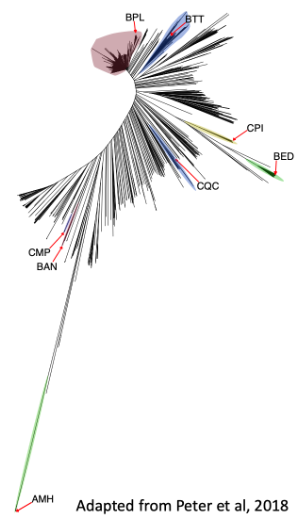

--- 
title: "Intraspecies proteome expression"
project: "Integrating timescales in protein evolution from distant species to populations"
author: "Benjamin Dubreuil"
github: "benjamin-elusers"
mail: "benjamin.dubreuil@weizmann.ac.il"
created: "24/04/2022"
date: "`r format(Sys.time(), '%d-%b-%Y %R %p')`"
site: bookdown::bookdown_site
# output: bookdown::gitbook
documentclass: book
bibliography:
- book.bib
- packages.bib
description: |
  This book is a report for analyzing a proteomic experiment between 8 isolated
  strains from Saccharomyces cerevisiae.
biblio-style: apalike
csl: chicago-fullnote-bibliography.csl
---
```{r include=FALSE, cache=FALSE}
# example R options set globally
options(width = 60)

# example chunk options set globally
knitr::opts_chunk$set(
  comment = "#>",
  collapse = TRUE
  )
```


# Introduction

## About

This project results from a collaboration between the groups of E. Levy (Weizmmann, IL)
and J. Schacherer (CNRS/Univ. Strasbourg). 

## Abstract

Cells and their proteomes constantly evolve and adapt to survive in a wide
variety of ecological niches. While phenotypic diversity arises in populations
on relatively short timescales (1 to 100s thousand years), longer timescales (1
to 100s million years) are involved in divergence between species. The
signatures of both evolutionary processes are carved in each and every single
protein sequence through accumulation of mutations, thereby reshaping cell
machineries, including protein complexes, signaling pathways, and metabolic
pathways for example.

Interestingly, over long timescales, different proteins accumulate mutations at
markedly different rates. For example, orthologous proteins in S. cerevisiae and
S. pombe share *42%* (+/- 14%) sequence identity on average, but some orthologs
exhibit higher conservation. For example, actins share *89.7%* sequence identity,
illustrating that some proteins tolerate mutations more than others. One
biophysical property correlates with sequence divergence more than any other and
that is protein abundance. The more abundant a protein, the more conserved its
sequence. While the abundance-conservation correlation is well established,
its mechanistic origin is not well understood. Toxicity associated with
mutation-induced misfolding has been suggested as a possible origin, but recent
works, including ours (Dubreuil et al. 2019) show it is unlikely
the main driving mechanism.

To resolve mechanisms shaping protein evolution, we propose to integrate
analyses of sequence evolution across timescales. On the one hand, evolution
across distant species shows wide dynamic range of sequence conservation, and
reflects how entire proteomes diverge with time. On the other hand, it also
presents two important drawbacks. First, that functional information of one
species (e.g., protein abundance) is implicitly extrapolated to other species,
and such an assumption is frequently incorrect. Second, the order in which
mutations occur can hardly be traced. For example, considering a gene
duplication event that occurred several million years ago, it is impossible to
distinguish mutations that occurred right after the duplication event from those
that arose later. Remarkably, both of these limitations are resolved when
measuring evolution across a population. Indeed, the short evolutionary
distances seen across strains mean that functional information can be
extrapolated with high confidence, and mutations can be situated in a narrow
time-window. Thus, by resolving these limitations, the integration of
evolutionary data across species and strains (Figure \@ref(fig:project-goal))
will provide new insights into constraints that biophysics (in particular
abundance) versus function place on protein evolution.

```{r project-goal, echo=F, fig.cap='Integrating timescales in protein evolution from distant species to populations', out.width = "100%"}
knitr::include_graphics("images/Fungi-SpeciesTree-v7.png")
```

```{r include=FALSE}
# automatically create a bib database for R packages
knitr::write_bib(c(
  .packages(), 'bookdown', 'knitr', 'rmarkdown'
), 'packages.bib')
```


```{r setup, include=F, echo=F, warnings=F, message=F}
# Make sure the install repositories for dependencies are CRAN + Bioconductor
#options(repos = c(getOption("repos"), BiocManager::repositories()))
knitr::opts_chunk$set(echo = T, collapse = T, cache.lazy = F,autodep = T, warning = F)
# HAVE TO INSTALL IN LINUX: Curl and Cairo library
suppressPackageStartupMessages({
  library(here)
  source("https://raw.githubusercontent.com/benjamin-elusers/yeastomics/main/src/__setup_yeastomics__.r")
  source(here("../src",'function_proteomics.r'))
})
# turn off annoying messages from dplyr::summarise
options(dplyr.summarise.inform = FALSE)
graphics.off()

# Yeast data
sc_annofile = here('../data','yeast-annotations.rds')
sc_annotation = preload(sc_annofile, load.annotation(),doing='loading annotations data for yeast...')
sc_annotation_orf = dplyr::select(sc_annotation,-c(SGD,GENENAME,ROLE,LOC,COMPLEX,node,nprot,nsp,taxon))
sc_identifiers = sc_annotation %>% dplyr::select(SGD,ORF,UNIPROT,GENENAME)

riboseq_strains = c('AMH','BAN','BED','BPL','BTT','CMP','CPI','CQC') # Strains with riboseq data (on 14/01/21)
strains.info = load.peter2018.data(1) %>%  # strains info from supp mat of Science paper
                 mutate( has_riboseq = standardized_name %in% riboseq_strains)

yk11_all_snp = left_join(readRDS(here('../data','YK11-SNP_NT.rds')),
                         readRDS(here('../data','YK11-SNP_AA.rds')), 
                         by=c('id', "aa_pos"='ref_pos', 'alt_codon_aa' = 'alt_aa'), 
                         suffix = c("_nt", "_aa") ) %>%
    left_join(sc_identifiers,by=c('id'='ORF'))


y8_all_snp = left_join(readRDS(here('../data','Y8-SNP_NT.rds')),
                       readRDS(here('../data','Y8-SNP_AA.rds')), 
                       by=c('id', "aa_pos"='ref_pos', 'alt_codon_aa' = 'alt_aa'),
                       suffix = c("_nt", "_aa")) %>% 
  left_join(sc_identifiers,by=c('id'='ORF'))

# Conservation/evolutionary rate
evo_fungi = read_delim(here('../output','evolution-fungi-protein.tsv'),delim='\t') 
evo_snp = read_delim(here('../output','evolution-snp-protein.tsv'),delim='\t') 
fungi_rate = evo_fungi %>% dplyr::select(r4s:leisr_local) %>% as.matrix
strains_rate = evo_snp %>% dplyr::select(r4s:leisr_local) %>% as.matrix
er_fungi_cor = cor(fungi_rate,use='pairwise.complete',met='spearman')
er_strains_cor = cor(strains_rate,use='pairwise.complete',met='spearman')
library(ggcorrplot)
ggcorrplot(er_fungi_cor,type='upper',method='circle',lab = T,lab_size = 3, title='fungi evo. rate')
ggcorrplot(er_strains_cor,type='upper',method='circle',lab = T,lab_size = 3, title='strains evo. rate')

er_fungi_worst   = colnames(er_fungi_cor)[ abs(er_fungi_cor[1,]) < 0.7 ]
er_strains_worst = colnames(er_strains_cor)[ abs(er_strains_cor[1,]) < 0.7 ]

# Keep the best evolutionary rates (correlates with r4s > 0.7)
evo_yeast = left_join(evo_snp,evo_fungi, by=c('id','len_ref'),suffix=c('.yk11','.fungi')) %>% 
            mutate(HAS_ORTHOLOG = !is.na(len_msa.fungi) ) %>% 
    left_join(sc_identifiers,by=c('id'='ORF')) %>% 
    dplyr::mutate( f_snp = n_mismatched/len_msa.yk11, pid.fungi=1-f_mismatched) %>%
    dplyr::rename(orf=id,n_snp = n_mismatched) %>%
    dplyr::select(-f_mismatched) %>%
    relocate(orf,UNIPROT,GENENAME,SGD,HAS_ORTHOLOG, len_ref,
             len_msa.yk11, n_snp,f_snp, len_msa.fungi,pid.fungi) %>% 
    dplyr::select(-paste0(er_fungi_worst,'.fungi'),-paste0(er_strains_worst,'.yk11'))

# test = evo_yeast%>% dplyr::select(n_snp:leisr_local.fungi) %>% as.matrix()
# test_cor = cor(test, use='pairwise.complete',method='spearman')
# ggcorrplot(test_cor,type='upper',method='circle',lab = T,lab_size = 3, title='')

#save.image(here::here('data','checkpoint-snp.rdata'))
```

<!--chapter:end:index.Rmd-->

```{r include=FALSE, cache=FALSE}
# example R options set globally
options(width = 60)

# example chunk options set globally
knitr::opts_chunk$set(
  comment = "#>",
  collapse = TRUE
  )
```
# Proteomics experiment

## Experiment design

For this experiment, we selected eight strains from a population
of 1,011 *S. cerevisiae* isolates, representing the overall ecological, geographical
and genetic diversity (Figure \@ref(fig:phylo-8-strain). 

The eight strains were grown on synthetic defined media (SD). We carefully monitored
the strains growth to harvest cells close to the mid-log phase (OD ~ 0.5). Then,
we proceed to wash the samples in PBS and flash-freeze cell pellets for a 
whole-lysate proteomics profiling.

For each strains, we prepared  biological replicates that originated from two
distinct colonies which and two technical replicates.

```{r phylo-8-strain, fig.cap='Phylogenetic tree of 1011 *cerevisiae* isolates highlighting the 8 strains used for RNASeq/RiboSeq/proteomics exepriment', out.width='40%', fig.align='center',echo=F}

```

Altogether there were 32 samples of yeast cell pellets including 4 replicates 
(two biological and two technical) that we sent to the Weizmann proteomics unit.
([INPCM](https://g-incpm.weizmann.ac.il/units/deBottonProteinProfiling/how-does-it-work%3F)).

The samples submitted correspond to 4mL cultures with OD ranging from 0.4-0.8. 

**OD of samples (table)**


## Sample preparation

The cell pellets were subjected to lysis and in solution tryptic digestion using
the S-Trap method (by Protifi) followed by a solid phase extraction cleaning step (Oasis HLB).

## Liquid chromatography mass spectrometry

The resulting peptides were analyzed using nanoflow liquid chromatography 
(nanoAcquity) coupled to high resolution, high mass accuracy mass spectrometry 
(Thermo Exploris 480). Each sample was analyzed on the instrument separately in 
a random order in discovery mode.

## Peptide identification and quantification

Raw data was processed with MaxQuant v1.6.6.0. The data were searched with the 
Andromeda search engine against a database containing protein sequences of 
*Saccharomyces cerevisiae* as downloaded from Uniprot.org, and appended with
common lab protein contaminants. 

The following modifications were defined for the search: 
Fixed modification- cysteine carbamidomethylation. 
Variable modifications- methionine oxidation and protein N-terminal acetylation. 

The quantitative comparisons were calculated using Perseus v1.6.0.7. 
Decoy hits were filtered out and only proteins that were detected
in at least two replicates of at least one experimental group were kept.

## Loading Mass Spectrometry Results

First, we read the MaxQuant output file (CSV/XLSX format) containing all the hits.
A hit corresponds to the set of peptides that were matched to a single protein group.
*Note: protein groups may contain one or multiple identified proteins (including contaminants)*

```{r read-data, echo=F}
# Maxquant files
evidence = here::here('../data','Raw_files','combined/txt','evidence.txt')
annotation = here::here('../results','keys.txt')
proteinGroups = here::here('../data','Raw_files','combined/txt','proteinGroups.txt')

# Reading maxquant protein data
ms0=read_maxquant(proteinGroups,zero.to.na = T, int_type = 'LFQ', pep_type = 'Unique peptides')
keys_cols = c('majority_protein_i_ds','gene_names')

# get sample_names
samples = str_subset(colnames(ms0),'lfq_intensity') %>% str_replace('lfq_intensity_',"")
nsamples=n_distinct(samples)

# define groups based on sample names
df.group = tibble(sample=toupper(samples)) %>%
            separate(col=sample, into= c('strain','biorep','techrep','dayrun'), sep = '_', remove = F) %>%
            mutate( biorep = paste0("R",biorep), techrep = paste0("r",techrep),dayrun=paste0(dayrun,"_04_22"))

all_strains = unique(df.group$strain)
nstrains = n_distinct(all_strains)
nreplicates = df.group %>% count(strain) %>% pull(n) %>% unique

# associate a palette of colors for each group
col.group = list(
  # spectral palette
  # strain = c('AMH'="#D53E4F", 'BAN'="#F46D43", 'BED'="#FDAE61", 'BPL'="#FEE08B",
              # 'BTT'="#E6F598", 'CMP'="#ABDDA4", 'CPI'="#66C2A5", 'CQC'="#3288BD"),
  # Set1 palette
  strain = c('AMH'="#E41A1C", 'BAN'="#377EB8", 'BED'="#4DAF4A", 'BPL'="#984EA3",
             'BTT'="#FF7F00", 'CMP'="#FFFF33", 'CPI'="#A65628", 'CQC'="#F781BF"),
  biorep = c('R1'="#002BDC",'R2'="#00A6E7"),
  techrep = c('r1'="#1C7947",'r2'="#39A388"),
  dayrun = c('10_04_22'='white','12_04_22'='black') 
  )
```

Statistics of proteomics hits:

```{r hit-stats,echo=F}
# Total number of hits
NHITS = n_distinct(ms0$protein_i_ds)
# Contaminants
is_contaminant = str_detect(ms0$protein_i_ds,"CON__")
NCON = n_distinct(ms0$protein_i_ds[is_contaminant])
# Reversed sequences (REV reversed sequences used by MaxQuant to estimate the FDR)
is_reversed = str_detect(ms0$protein_i_ds,"REV__")
NREV = n_distinct(ms0$protein_i_ds[is_reversed])
# Proteins
is_protein_group = !is_contaminant & !is_reversed
NPROT = n_distinct(ms0$protein_i_ds[is_protein_group])

# Multiple proteins matched
NSINGLE = sum(ms0$number_of_proteins==1 & is_protein_group)
NMULTI = sum(ms0$number_of_proteins > 1 & is_protein_group)
NDUP = sum(ms0$number_of_proteins==2 & is_protein_group)
```

**`r NHITS`** total hits

 - **`r NCON`** contaminants
 - **`r NREV`** reversed sequences
 - **`r NPROT`** proteins identified:
   - **`r NSINGLE`** unique proteins
   - **`r NMULTI`** multiple proteins (with `r NMULTI` duplicated pairs)

**In this proteomics experiment, a large number of proteins were identified and quantified.
The quantified cellular proteome roughly amounts to half of the reference proteome sequences
of the yeast *S. cerevisiae* S288C**

<!--chapter:end:01-proteomics.Rmd-->

```{r include=FALSE, cache=FALSE}
# example R options set globally
options(width = 60)

# example chunk options set globally
knitr::opts_chunk$set(
  comment = "#>",
  collapse = TRUE
  )
```
# Quality control {#qc}

## Boxplot of sample raw intensities

Second, we want to inspect the distribution of peptide intensities between strains.
In addition, we will also observe in how many replicates each hit was quantified.

```{r boxplot-int_ub, echo=F, fig.cap='Distribution of expression for ubiquitous hits (i.e. detected in all strains)'}
# get lfq-peptide intensities (lfq=label-free quantitation) 
intensities = ms0 %>% dplyr::select(uniprot=majority_protein_i_ds,starts_with("lfq")) 

# Convert intensities to long format 
long_int_all = get_long_intensities(intensities)

# Get intensities for ubiquitously detected hits between strains
long_intensities = long_int_all %>% 
  filter(ratio_na_rep<1) %>% # At least one peptide in one replicate from a each strain
  group_by(strain) %>% mutate(nprot = n_distinct(uniprot)) %>% 
  hablar::convert(n_na_rep=int(n_na_rep)) %>% 
  arrange(n_na_rep)

# Get median expression and # proteins per strain as a function of NAs in replicates
stats_per_strain=long_intensities %>% 
  group_by(strain=toupper(strain),n_na_rep=factor(n_na_rep)) %>% 
  summarize(nprot=n_distinct(uniprot), MED=median_(log10_int)) %>% 
  mutate( YMAX = 12.5 - 0.25*as.numeric(n_na_rep))

# Compare intensities of ubiquitous hits between strains
bp=ggplot(data=long_intensities,mapping=aes(y=log10_int,x=toupper(strain))) +
  ggbeeswarm::geom_quasirandom(mapping = aes(group=n_na_rep,color=as.factor(nreplicates-n_na_rep)), na.rm=TRUE) +
  geom_violin(alpha=0.2, na.rm=TRUE,draw_quantiles = c(0.25,0.5,0.75)) + 
  geom_text(data=stats_per_strain,aes(label=nprot,color=nreplicates-n_na_rep,x=strain,y=YMAX),show.legend = F) +
  ylim(5,12.5) +
  ylab('Peptides intensities (log10)') + labs(x='Strains', colour='expressed in # replicates') +
  theme_pubclean() + grids(axis = 'y') + theme(axis.text = element_text(size=12)) +
  scale_color_canva(palette = "Pool party",limits=rev)
plot(bp)

BY_STRAINS = group_by(long_intensities,strain=toupper(strain)) %>% 
             summarize(median_exp=median_(log10_int))
BY_REP = group_by(long_intensities, n_replicates=as.integer(4-n_na_rep)) %>% 
  summarize(median_exp=median_(log10_int)) 

library(kableExtra)
TAB_STRAINS_EXP = kbl( transpose(BY_STRAINS) ,digits = 2) %>%
  kable_paper("striped", full_width = F) %>% kable_styling()

TAB_REP_EXP = kbl( transpose(round(BY_REP,1)) ) %>%
  kable_paper("striped", full_width = F) %>% kable_styling()  

```

**The distribution of peptide intensities between strains is relatively similar between strains:**
`r TAB_STRAINS_EXP`

**However, the peptide intensities can vary widely (1 unit = 10-fold) when a hit is not detected across all replicates:**
`r TAB_REP_EXP`

**On average, peptide intensities increase when a hit is found in more than one replicate**

We then look at hits quantified as a function of the number of strains in which 
at least one peptide was quantified. (non-ubiquitous hits)

```{r missing-hit, echo=F, fig.cap='Distribution of expression for hits not detected in all strains'}
pep_missing = long_int_all %>%
  filter(ratio_na_rep==1) %>% 
  dplyr::select(-c(bio,tech)) %>% 
  distinct()

hit_missing = pep_missing$uniprot

bp_miss= long_int_all %>% arrange(n_na_strains) %>% 
         dplyr::filter(has_missing_strains) %>%
  ggplot(mapping=aes(y=log10_int,x=8-n_na_strains)) +
  geom_violin(mapping=aes(fill=factor(n_na_strains)),
              alpha=0.2, na.rm=TRUE,draw_quantiles = c(0.25,0.5,0.75),color='black',show.legend = F) +
  geom_text(aes(label=nprot_miss),y=12,check_overlap = T,col='red') + ylim(5,12) +
  ylab('Peptides intensities (log10)') + labs(x='expressed across # strains') +
  scale_x_continuous(breaks=0:8) +
  theme_pubclean() + grids(axis = 'y') + theme(axis.text = element_text(size=12))
  
plot(bp_miss)

stat_per_miss = long_int_all %>% 
  dplyr::select(n_na_strains,nprot) %>%
  mutate(n_strains= nstrains-n_na_strains) %>%
  distinct() %>% 
  ungroup() %>%
  arrange(desc(n_strains)) %>%
  mutate( f_exp = sprintf("%.1f%%",100*cumsum(nprot)/sum(nprot)) ) %>%
  dplyr::select(n_strains,n_na_strains,nprot,f_exp)


TAB_EXP_STRAIN = kbl(stat_per_miss,digits = 2) %>%
  kable_paper("striped", full_width = F) %>% kable_styling()

```

`r TAB_EXP_STRAIN`

**Similarly, we found a lower peptide intensity when a hit was found 
across less strains. Nevertheless, almost two thirds of the hits were detected in all strains.
Up to 87% of the hits were expressed across at least 5 out of 8 strains.**


## Number of missing values in samples

Furthermore, we can check whether the proportion of missing values is equally 
distributed among all samples.

```{r na-samples, echo=F, fig.height=12, fig.width=10, fig.cap='Number of quantified intensities across samples'}
# Count hits with NA in samples/groups
na_int= intensities %>% 
        group_by(uniprot) %>%
        summarize(across(all_of(paste0("lfq_intensity_",samples)), is.na ) )
colnames(na_int) = c('uniprot',samples)

ComplexUpset::upset(data=as.data.frame(1-na_int[,-1]),intersect=samples,
      name='intensity quantified', min_degree=5, sort_sets=F, 
      width_ratio=0.1,min_size=10, keep_empty_groups=F, wrap=TRUE,
         base_annotations=list(
          'Number of hits'=ComplexUpset::intersection_size(text_colors=c(on_background='red', on_bar='yellow'),text=list(angle=0,hjust=0.45,size=2.8))
           + annotate( geom='text', x=Inf, y=Inf, label=paste('Total hits:', nrow(na_int)), vjust=1, hjust=1 )
         ),
)


```

<!--chapter:end:02-QC.Rmd-->

```{r include=FALSE, cache=FALSE}
# example R options set globally
options(width = 60)

# example chunk options set globally
knitr::opts_chunk$set(
  comment = "#>",
  collapse = TRUE
  )
```
# Parts

You can add parts to organize one or more book chapters together. Parts can be inserted at the top of an .Rmd file, before the first-level chapter heading in that same file. 

Add a numbered part: `# (PART) Act one {-}` (followed by `# A chapter`)

Add an unnumbered part: `# (PART\*) Act one {-}` (followed by `# A chapter`)

Add an appendix as a special kind of un-numbered part: `# (APPENDIX) Other stuff {-}` (followed by `# A chapter`). Chapters in an appendix are prepended with letters instead of numbers.


<!--chapter:end:03-parts.Rmd-->

```{r include=FALSE, cache=FALSE}
# example R options set globally
options(width = 60)

# example chunk options set globally
knitr::opts_chunk$set(
  comment = "#>",
  collapse = TRUE
  )
```
# Footnotes and citations 

## Footnotes

Footnotes are put inside the square brackets after a caret `^[]`. Like this one ^[This is a footnote.]. 

## Citations

Reference items in your bibliography file(s) using `@key`.

For example, we are using the **bookdown** package [@R-bookdown] (check out the last code chunk in index.Rmd to see how this citation key was added) in this sample book, which was built on top of R Markdown and **knitr** [@xie2015] (this citation was added manually in an external file book.bib). 
Note that the `.bib` files need to be listed in the index.Rmd with the YAML `bibliography` key.


The `bs4_book` theme makes footnotes appear inline when you click on them. In this example book, we added `csl: chicago-fullnote-bibliography.csl` to the `index.Rmd` YAML, and include the `.csl` file. To download a new style, we recommend: https://www.zotero.org/styles/


The RStudio Visual Markdown Editor can also make it easier to insert citations: <https://rstudio.github.io/visual-markdown-editing/#/citations>

<!--chapter:end:04-citations.Rmd-->

```{r include=FALSE, cache=FALSE}
# example R options set globally
options(width = 60)

# example chunk options set globally
knitr::opts_chunk$set(
  comment = "#>",
  collapse = TRUE
  )
```
# Blocks

## Equations

Here is an equation.

\begin{equation} 
  f\left(k\right) = \binom{n}{k} p^k\left(1-p\right)^{n-k}
  (\#eq:binom)
\end{equation} 

You may refer to using `\@ref(eq:binom)`, like see Equation \@ref(eq:binom).


## Theorems and proofs

Labeled theorems can be referenced in text using `\@ref(thm:tri)`, for example, check out this smart theorem \@ref(thm:tri).

::: {.theorem #tri}
For a right triangle, if $c$ denotes the *length* of the hypotenuse
and $a$ and $b$ denote the lengths of the **other** two sides, we have
$$a^2 + b^2 = c^2$$
:::

Read more here <https://bookdown.org/yihui/bookdown/markdown-extensions-by-bookdown.html>.

## Callout blocks


The `bs4_book` theme also includes special callout blocks, like this `.rmdnote`.

::: {.rmdnote}
You can use **markdown** inside a block.

```{r collapse=TRUE}
head(beaver1, n = 5)
```

:::

It is up to the user to define the appearance of these blocks for LaTeX output. 

You may also use: `.rmdcaution`, `.rmdimportant`, `.rmdtip`, or `.rmdwarning` as the block name.


The R Markdown Cookbook provides more help on how to use custom blocks to design your own callouts: https://bookdown.org/yihui/rmarkdown-cookbook/custom-blocks.html

<!--chapter:end:05-blocks.Rmd-->

```{r include=FALSE, cache=FALSE}
# example R options set globally
options(width = 60)

# example chunk options set globally
knitr::opts_chunk$set(
  comment = "#>",
  collapse = TRUE
  )
```
# Sharing your book

## Publishing

HTML books can be published online, see: https://bookdown.org/yihui/bookdown/publishing.html

## 404 pages

By default, users will be directed to a 404 page if they try to access a webpage that cannot be found. If you'd like to customize your 404 page instead of using the default, you may add either a `_404.Rmd` or `_404.md` file to your project root and use code and/or Markdown syntax.

## Metadata for sharing

Bookdown HTML books will provide HTML metadata for social sharing on platforms like Twitter, Facebook, and LinkedIn, using information you provide in the `index.Rmd` YAML. To setup, set the `url` for your book and the path to your `cover-image` file. Your book's `title` and `description` are also used.


This `bs4_book` provides enhanced metadata for social sharing, so that each chapter shared will have a unique description, auto-generated based on the content.

Specify your book's source repository on GitHub as the `repo` in the `_output.yml` file, which allows users to view each chapter's source file or suggest an edit. Read more about the features of this output format here:

https://pkgs.rstudio.com/bookdown/reference/bs4_book.html

Or use:

```{r eval=FALSE}
?bookdown::bs4_book
```


<!--chapter:end:06-share.Rmd-->

```{r include=FALSE, cache=FALSE}
# example R options set globally
options(width = 60)

# example chunk options set globally
knitr::opts_chunk$set(
  comment = "#>",
  collapse = TRUE
  )
```
`r if (knitr::is_html_output()) '
# References {-}

1.	Drummond, D. A., Raval, A. & Wilke, C. O. A single determinant dominates the rate of yeast protein evolution. Mol. Biol. Evol. 23, 327–337 (2006).
2.	Drummond, D. A. & Wilke, C. O. Mistranslation-induced protein misfolding as a dominant constraint on coding-sequence evolution. Cell 134, 341–352 (2008).
3.	Drummond, D. A., Bloom, J. D., Adami, C., Wilke, C. O. & Arnold, F. H. Why highly expressed proteins evolve slowly. Proc. Natl. Acad. Sci. U. S. A. 102, 14338–14343 (2005).
4.	Pal, C., Papp, B. & Hurst, L. D. Highly expressed genes in yeast evolve slowly. Genetics 158, 927–931 (2001).
5.	Jimenez, M. J., Arenas, M. & Bastolla, U. Substitution rates predicted by stability-constrained models of protein evolution are not consistent with empirical data. Mol. Biol. Evol. (2017). doi:10.1093/molbev/msx327
6.	Schavemaker, P. E., Śmigiel, W. M. & Poolman, B. Ribosome surface properties may impose limits on the nature of the cytoplasmic proteome. Elife 6, (2017).
7.	Yang, J. R., Liao, B. Y., Zhuang, S. M. & Zhang, J. Z. Protein misinteraction avoidance causes highly expressed proteins to evolve slowly. Proc. Natl. Acad. Sci. U. S. A. 109, E831–E840 (2012).
8.	Plata, G. & Vitkup, D. Avoidance of toxic misfolding and protein stability do not explain the sequence constraints of highly expressed proteins. Mol. Biol. Evol. (2017). doi:10.1093/molbev/msx323

'`

<!--chapter:end:07-references.Rmd-->

