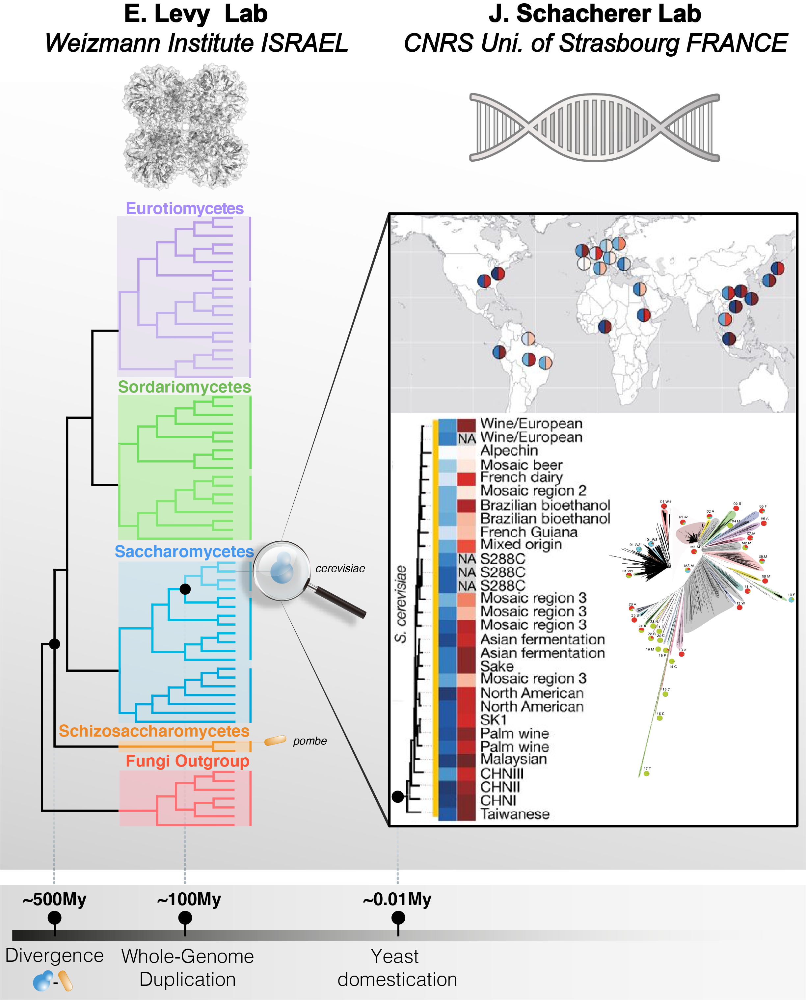

--- 
title: "Intraspecies proteome expression"
project: "Integrating timescales in protein evolution from distant species to populations"
author: "Benjamin Dubreuil"
github: "benjamin-elusers"
mail: "benjamin.dubreuil@weizmann.ac.il"
created: "24/04/2022"
date: "`r format(Sys.time(), '%d-%b-%Y %R %p')`"
home: ""
site: bookdown::bookdown_site
documentclass: book
bibliography:
- book.bib
- packages.bib
description: |
  This book is a report for analyzing a proteomic experiment between 8 isolated
  strains from Saccharomyces cerevisiae.
biblio-style: apalike
csl: chicago-fullnote-bibliography.csl
---


# Introduction

## About

This project results from a collaboration between the groups of E. Levy (Weizmmann, IL)
and J. Schacherer (CNRS/Univ. Strasbourg). 

## Abstract

Cells and their proteomes constantly evolve and adapt to survive in a wide
variety of ecological niches. While phenotypic diversity arises in populations
on relatively short timescales (1 to 100s thousand years), longer timescales (1
to 100s million years) are involved in divergence between species. The
signatures of both evolutionary processes are carved in each and every single
protein sequence through accumulation of mutations, thereby reshaping cell
machineries, including protein complexes, signaling pathways, and metabolic
pathways for example.

Interestingly, over long timescales, different proteins accumulate mutations at
markedly different rates. For example, orthologous proteins in S. cerevisiae and
S. pombe share *42%* (+/- 14%) sequence identity on average, but some orthologs
exhibit higher conservation. For example, actins share *89.7%* sequence identity,
illustrating that some proteins tolerate mutations more than others. One
biophysical property correlates with sequence divergence more than any other and
that is protein abundance. The more abundant a protein, the more conserved its
sequence. While the abundance-conservation correlation is well established,
its mechanistic origin is not well understood. Toxicity associated with
mutation-induced misfolding has been suggested as a possible origin, but recent
works, including ours (Dubreuil et al. 2019) show it is unlikely
the main driving mechanism.

To resolve mechanisms shaping protein evolution, we propose to integrate
analyses of sequence evolution across timescales. On the one hand, evolution
across distant species shows wide dynamic range of sequence conservation, and
reflects how entire proteomes diverge with time. On the other hand, it also
presents two important drawbacks. First, that functional information of one
species (e.g., protein abundance) is implicitly extrapolated to other species,
and such an assumption is frequently incorrect. Second, the order in which
mutations occur can hardly be traced. For example, considering a gene
duplication event that occurred several million years ago, it is impossible to
distinguish mutations that occurred right after the duplication event from those
that arose later. Remarkably, both of these limitations are resolved when
measuring evolution across a population. Indeed, the short evolutionary
distances seen across strains mean that functional information can be
extrapolated with high confidence, and mutations can be situated in a narrow
time-window. Thus, by resolving these limitations, the integration of
evolutionary data across species and strains (Figure \@ref(fig:project-goal))
will provide new insights into constraints that biophysics (in particular
abundance) versus function place on protein evolution.

```{r project-goal, echo=F, fig.cap='Integrating timescales in protein evolution from distant species to populations', out.width = "100%"}

```

```{r include=FALSE}
# automatically create a bib database for R packages
knitr::write_bib(c(
  .packages(), 'bookdown', 'knitr', 'rmarkdown'
), 'packages.bib')
```


```{r setup, include=F, echo=F, warnings=F, message=F}
# Make sure the install repositories for dependencies are CRAN + Bioconductor
#options(repos = c(getOption("repos"), BiocManager::repositories()))
knitr::opts_chunk$set(echo = T, collapse = T, cache.lazy = F,autodep = T, warning = F)
# HAVE TO INSTALL IN LINUX: Curl and Cairo library
suppressPackageStartupMessages({
  library(here)
  source("https://raw.githubusercontent.com/benjamin-elusers/yeastomics/main/src/__setup_yeastomics__.r")
  source(here("../src",'function_proteomics.r'))
})
# turn off annoying messages from dplyr::summarise
options(dplyr.summarise.inform = FALSE)
graphics.off()

# Yeast data
sc_annofile = here('../data','yeast-annotations.rds')
sc_annotation = preload(sc_annofile, load.annotation(),doing='loading annotations data for yeast...')
sc_annotation_orf = dplyr::select(sc_annotation,-c(SGD,GENENAME,ROLE,LOC,COMPLEX,node,nprot,nsp,taxon))
sc_identifiers = sc_annotation %>% dplyr::select(SGD,ORF,UNIPROT,GENENAME)

riboseq_strains = c('AMH','BAN','BED','BPL','BTT','CMP','CPI','CQC') # Strains with riboseq data (on 14/01/21)
strains.info = load.peter2018.data(1) %>%  # strains info from supp mat of Science paper
                 mutate( has_riboseq = standardized_name %in% riboseq_strains)

yk11_all_snp = left_join(readRDS(here('../data','YK11-SNP_NT.rds')),
                         readRDS(here('../data','YK11-SNP_AA.rds')), 
                         by=c('id', "aa_pos"='ref_pos', 'alt_codon_aa' = 'alt_aa'), 
                         suffix = c("_nt", "_aa") ) %>%
    left_join(sc_identifiers,by=c('id'='ORF'))


y8_all_snp = left_join(readRDS(here('../data','Y8-SNP_NT.rds')),
                       readRDS(here('../data','Y8-SNP_AA.rds')), 
                       by=c('id', "aa_pos"='ref_pos', 'alt_codon_aa' = 'alt_aa'),
                       suffix = c("_nt", "_aa")) %>% 
  left_join(sc_identifiers,by=c('id'='ORF'))

# Conservation/evolutionary rate
evo_fungi = read_delim(here('../output','evolution-fungi-protein.tsv'),delim='\t') 
evo_snp = read_delim(here('../output','evolution-snp-protein.tsv'),delim='\t') 
fungi_rate = evo_fungi %>% dplyr::select(r4s:leisr_local) %>% as.matrix
strains_rate = evo_snp %>% dplyr::select(r4s:leisr_local) %>% as.matrix
er_fungi_cor = cor(fungi_rate,use='pairwise.complete',met='spearman')
er_strains_cor = cor(strains_rate,use='pairwise.complete',met='spearman')
library(ggcorrplot)
ggcorrplot(er_fungi_cor,type='upper',method='circle',lab = T,lab_size = 3, title='fungi evo. rate')
ggcorrplot(er_strains_cor,type='upper',method='circle',lab = T,lab_size = 3, title='strains evo. rate')

er_fungi_worst   = colnames(er_fungi_cor)[ abs(er_fungi_cor[1,]) < 0.7 ]
er_strains_worst = colnames(er_strains_cor)[ abs(er_strains_cor[1,]) < 0.7 ]

# Keep the best evolutionary rates (correlates with r4s > 0.7)
evo_yeast = left_join(evo_snp,evo_fungi, by=c('id','len_ref'),suffix=c('.yk11','.fungi')) %>% 
            mutate(HAS_ORTHOLOG = !is.na(len_msa.fungi) ) %>% 
    left_join(sc_identifiers,by=c('id'='ORF')) %>% 
    dplyr::mutate( f_snp = n_mismatched/len_msa.yk11, pid.fungi=1-f_mismatched) %>%
    dplyr::rename(orf=id,n_snp = n_mismatched) %>%
    dplyr::select(-f_mismatched) %>%
    relocate(orf,UNIPROT,GENENAME,SGD,HAS_ORTHOLOG, len_ref,
             len_msa.yk11, n_snp,f_snp, len_msa.fungi,pid.fungi) %>% 
    dplyr::select(-paste0(er_fungi_worst,'.fungi'),-paste0(er_strains_worst,'.yk11'))

# test = evo_yeast%>% dplyr::select(n_snp:leisr_local.fungi) %>% as.matrix()
# test_cor = cor(test, use='pairwise.complete',method='spearman')
# ggcorrplot(test_cor,type='upper',method='circle',lab = T,lab_size = 3, title='')

#save.image(here::here('data','checkpoint-snp.rdata'))
```